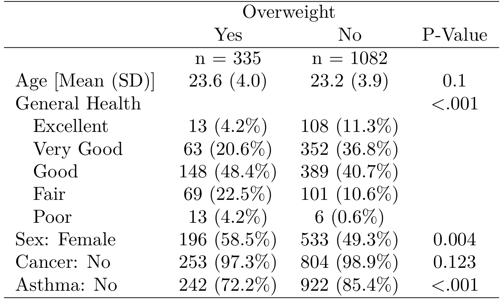
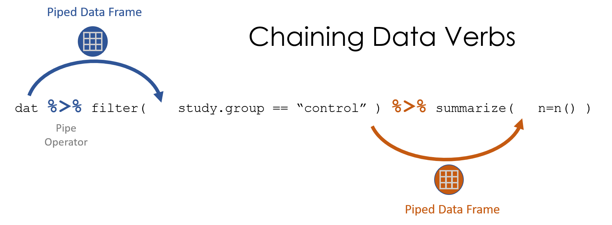

```{r setup, include=FALSE}
options(htmltools.dir.version = FALSE)

knitr::opts_chunk$set(comment     = ">",
                      echo        = TRUE)

library(tidyverse)
library(kableExtra)
```


# Download Software

```{r, echo=FALSE, warning=FALSE, error=FALSE, message=FALSE}

knitr::include_graphics("figures/R_studio_LaTeX_header.png")
```

Directions: [Encyclopedia, Vol. 0: Install Software](https://cehs-research.github.io/eBook_install/install-software.html)


---

# `R` vs. `R Studio`

<br>

.huge[If `R` is like a car's engine, then `RStudio` is the steering wheel, the pedals, and the comfortable seat]

--
.pull-left[.huge[.center[
`R`

[www.r-project.org](https://cran.cnr.berkeley.edu/)
]]]

.pull-right[.huge[.center[
`RStudio`

[www.rstudio.com](https://www.rstudio.com/products/rstudio/download/)
]]]

---
# Focus on what is needed in `R`

<br>

.center[.Huge[
".dcoral[Success] is neither magical nor mysterious. Success is the natural consequence of consistently applying the .nicegreen[basic fundamentals]." --- Jim Rohn
]]

.footnote[https://www.brainyquote.com/quotes/jim_rohn_122132?src=t_fundamentals]


---
# Intro to `R`

.pull-left[.huge[
Why Use `R`?
]
.large[
- .coral[**Free**]ly available
- Almost always up-to-date
- Best .bluer[data visualizations]
- .nicegreen[Syntax oriented] (easy to reproduce analyses)
- Gets updated regularly
- You can make your .gray1[own functionality] (e.g., `table1()`)
]]

--

.pull-right[
.huge[`table1()` produces 👇] 
<br>

]


---
count: false
# Intro to `R`

.pull-left[.huge[
Why Use `R`?
]
.large[
- .coral[**Free**]ly available
- Almost always up-to-date
- Best .bluer[data visualizations]
- .nicegreen[Syntax oriented] (easy to reproduce analyses)
- Gets updated regularly
- You can make your .gray1[own functionality] (e.g., `table1()`)
]]

.pull-right[.huge[
Any Issues?
]
.large[
- Learning curve
- Too extensive (people often focus on too much)
- Advisor's sometimes don't use it

The pro's heavily outweight the con's *if* you are willing to use it. It can save you tons of time in the long-run.
]]

---

## .coral[Objects] are Nouns

Virtual objects are like physical objects (e.g., a car is good to travel in, a table not so much)

`R` uses virtual objects 

- a `vector` is values concatinated together
- a `data.frame` is a group of vectors of the same length

--

.pull-left[

.large[.bluer[Vector]]

concatinate or combine


```{r}
c(1, 3, 5, 7, 11, 13)
```

]

--


.pull-right[

.large[.bluer[Data Frame]]

named vectors of the same length

```{r}
data.frame(x = c(1, 3, 5, 7),
           y = c(2, 4, 6, 8))
```
]


---

## .coral[Objects]: save into global environment

.pull-left[


.large[Assignment symbol:  .coral[<-]]


.large[.bluer[Constant]]


```{r}
fred <- 13
```

```{r}
fred
```


.large[.bluer[Vector]]

```{r}
odds <- c(1, 3, 5, 7, 11, 13)
```

```{r}
odds
```

]

--

.pull-right[

.large[.bluer[Data Frame]]

```{r}
df <- data.frame(x = c(1, 3, 5, 7),
                 y = c(2, 4, 6, 8))
```

```{r}
df
```


]


---

## .coral[Class] of a variable: .nicegreen[numeric (dbl)]


.pull-leftbig[

```{r}
df <- data.frame(id   = c(100, 101, 102, 103),
                 name = c("Joe", "Jill", "Meg", "Pat"),
                 age  = c(10, 9, 10, 11),
                 trt  = as.factor(c("A", "B", "A", "B")))
```

```{r}
df
```

]

--


.pull-rightsmall[

.large[dataframe.coral[$]variable]


```{r}
df$id
```

.large[numbers are not quoted]


```{r}
class(df$id)
```

]

---

## .coral[Class] of a variable: .nicegreen[numeric (dbl)]


.pull-leftbig[

```{r}
df <- data.frame(id   = c(100, 101, 102, 103),
                 name = c("Joe", "Jill", "Meg", "Pat"),
                 age  = c(10, 9, 10, 11),
                 trt  = as.factor(c("A", "B", "A", "B")))
```

```{r}
df
```

]


.pull-rightsmall[

.large[dataframe.coral[$]variable]

```{r}
df$age
```

.large[numbers are not quoted]

```{r}
class(df$age)
```

]

---

## .coral[Class] of a variable: .nicegreen[character (chr)]


.pull-leftbig[

```{r}
df <- data.frame(id   = c(100, 101, 102, 103),
                 name = c("Joe", "Jill", "Meg", "Pat"),
                 age  = c(10, 9, 10, 11),
                 trt  = as.factor(c("A", "B", "A", "B")))
```

```{r}
df
```

]


.pull-rightsmall[

.large[dataframe.coral[$]variable]

```{r}
df$name
```

.large[text is quoted]

```{r}
class(df$name)
```

]


---

## .coral[Class] of a variable: .nicegreen[factor (fct)]


.pull-leftbig[

```{r}
df <- data.frame(id   = c(100, 101, 102, 103),
                 name = c("Joe", "Jill", "Meg", "Pat"),
                 age  = c(10, 9, 10, 11),
                 trt  = as.factor(c("A", "B", "A", "B")))
```

```{r}
df
```

]


.pull-rightsmall[

.large[dataframe.coral[$]variable]

```{r}
df$trt
```

.large[factors have levels]

```{r}
class(df$trt)
```

]

---
## .coral[Functions] are Verbs


.pull-left[.large[

Generally looks like: 

`stuff(arg1, arg2)`
...or...

`pkg::stuff(arg1, arg2)`

- `pkg` package the function is from
- `stuff` function's name
- `()` surround the arguments
- `arg1` and `arg2` arguments or options
]]

--

.pull-right[
.large[Example: "mean" function

- `mean()` 
- 1 argument required: a variable
- returns variable's average
]
```{r}
## This is a comment 
mean(df$age)
```

...does the same thing...

```{r}
base::mean(df$age)
```

]

---

## .coral[Functions] are Verbs

```{r, echo=FALSE}
knitr::include_graphics("figures/data_verb_input_output.png")
```


---
## .coral[Missing Values] are lack of data

- `NA` represents missing or blank values
- there are no quotes around the `NA`

.pull-leftbig[

```{r}
df <- data.frame(id   = c(100, 101, 102, 103),
                 name = c("Joe", "Jill", "Meg", "Pat"),
                 age  = c(10, 9.5, NA, 11),
                 trt  = as.factor(c("A", "B", "A", "B")))
```

```{r}
df
```

]

--

.pull-rightsmall[


```{r}
mean(df$age)
```


default: 
- keeps in missing values
- NA in data cases NA in mean

```{r}
mean(df$age, na.rm = TRUE)
```

]


---

## .coral[Functions]: what package is it from?


.pull-leftsmall[

Function in Base R

```{r}
dim(df)
```


```{r}
names(df)
```


]

--

.pull-rightbig[

Function from a specific package

```{r}
tibble::glimpse(df)
```

]


---

## The .coral[Tidyverse]

```{r, echo=FALSE, warning=FALSE, error=FALSE, message=FALSE}

knitr::include_graphics("figures/tidyverse.png")
```

---

## The .coral[Tidyverse]


https://rworkshop.uni.lu/lectures/lecture05_dplyr.html#1 

```{r}
library(tidyverse)
```


---
## The .coral[Pipe] links steps


The symbol is typed .nicegreen[`%>%`]

.pull-left[

```{r}
mean(df$age, na.rm = TRUE)
```

```{r}
df$age %>% mean(na.rm = TRUE)
```

]

.pull-right[


```{r, echo=FALSE}

```

]


---

```{r, echo=FALSE}

```


---


```{r, echo=FALSE, out.width = '75%'}

```

--

```{r, echo=FALSE, out.width = '75%'}

```

---
## Build a .coral[Pipeline]


```{r, echo=FALSE}

```

---

```{r, echo=FALSE}

```


---

```{r, echo=FALSE, out.width = '75%'}

```


---

```{r, echo=FALSE, out.width = '75%'}

```

---

```{r, echo=FALSE, out.width = '75%'}


```


---

## Build a .coral[Pipeline]

```{r, echo=FALSE}

```


---
# Important first steps in `R`

.large[.large[
1. Read in Data
2. Quickly assess the data
3. Clean the data
4. Analyze the data
]]

--

.large[We'll show each of these over the next few weeks starting with reading in, assessing and cleaning the data]


---
# Read in the data

.huge[Data comes in various files:]

.pull-left[.large[
- CSV
- tab-delimited
- SPSS
- Excel
]]
.pull-right[.large[
- SAS
- Stata
- Mplus
- etc.
]]

--
### `R` can read all types

--

.huge[Generally, it all works in a similar way]

---
# Read in data: FORMAT

.large[Text: .bluer[Comma-seperated]]

```{r, eval = FALSE}
my_data <- read.csv("my_data_file.csv")
```

--

.large[Text: .bluer[tab-delimited]]

```{r, eval = FALSE}
my_data <- read.delim("my_data_file.txt")
```

--

.large[.bluer[Excel]]: .xls, .xlsx

```{r, eval = FALSE}
library(readxl)
my_data <- readxl::read_excel("my_data_file.xlsx")
```

--

.large[.bluer[SPSS]]: .sav

```{r, eval = FALSE}
library(haven)
my_data <- haven::read_spss("my_data_file.sav")
```

---
background-image: url(figures/fig_inho_data_desc.png)
background-position: 50% 90%
background-size: 800px

# Let's use the data from the book


---
# Steps for .dcoral[Preparing] the Data for Analysis

.large[.large[
1. .coral[Get the data]
2. .nicegreen[Prep the data]
    - Variable Labels 	
    - Value Labels	
    - Missing Values
3. .bluer[Compute] new variables and values (fill in missing codes, recode scores, categorize/group values, combine)
4. Get .dcoral[descriptives] using `tableF()` and `table1()` from the `furniture` package to check what is going on
]]

---
# Step 1: Get the data

Data is in .xls form (Excel) saved in the folder with .Rmd file

```{r, eval=FALSE}
library(readxl)
d <- readxl::read_excel("Ihno_dataset.xls")
d
```

```{r, echo=FALSE}
library(readxl)
d <- readxl::read_excel("data/Ihno_dataset.xls")
d
```


---
# Step 2: Prep the data

```{r, message=FALSE, warning=FALSE}
library(tidyverse)

d_clean <- d %>%
  dplyr::mutate(MajorF = factor(Major, 
                                levels = c(1, 2, 3, 4, 5),
                                labels = c("Psychology", "Premed",
                                           "Biology", "Sociology",
                                           "Economics"))) %>%
  dplyr::mutate(Coffee = factor(Coffee))

d_clean
```


---
# Step 3: Compute new variables/values

```{r}
d_clean <- d_clean %>%
  dplyr::mutate(newVar = Mathquiz / 2)
```
*Note that I removed the other variables just to show you but in reality all the variables are still there. Also I only want to show the first few rows.
```{r}
d_clean %>% dplyr::select(Mathquiz, newVar) %>% head()
```


---
# Step 4: Get descriptives

.pull-left[
```{r, message=FALSE, warning=FALSE}
library(furniture)

furniture::tableF(d_clean, MajorF)
```
]

.pull-right[
```{r, message=FALSE, warning=FALSE}
furniture::tableF(d_clean, Phobia)
```
]


---
# Step 4: Get descriptives

```{r}
d_clean %>% 
  dplyr::group_by(MajorF) %>% 
  furniture::table1(Mathquiz, Phobia, Coffee)
```

---
class: inverse, center, middle

# Questions?


---
class: inverse, center, middle

# Next Topics

### More Data Manipulation
### Understanding Data via Figures


