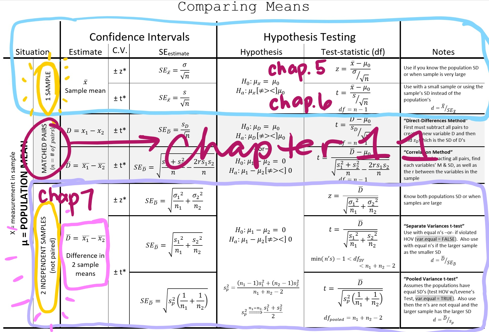
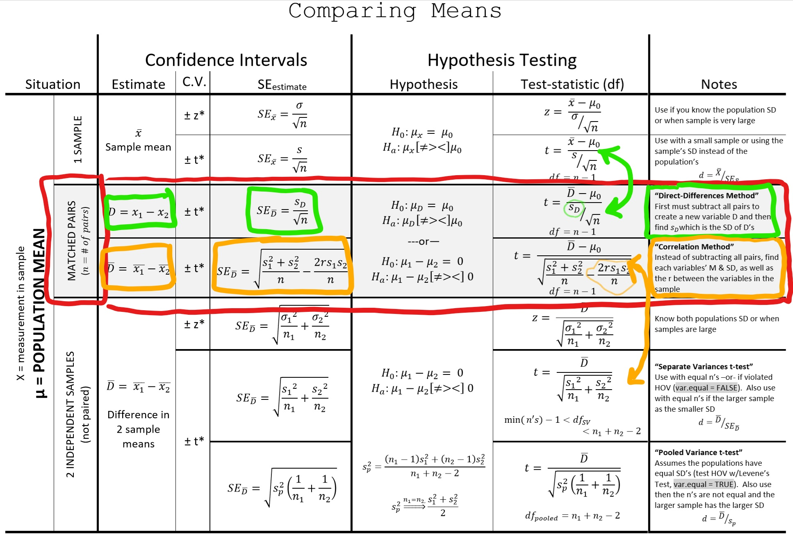

```{r setup, include=FALSE}
options(htmltools.dir.version = FALSE)
knitr::opts_chunk$set(comment     = NA,
                      cache       = TRUE,
                      echo        = TRUE, 
                      warning     = FALSE, 
                      message     = FALSE,
                      fig.align   = "center",   # center all figures
                      fig.width   = 6.5,        # set default figure width to 4 inches
                      fig.height  = 4.5)        # set default figure height to 3 inches
```

class: center, middle

## "…we are suffering from a plethora of surmise, conjecture, and hypothesis. The difficulty is to detach the framework of fact *– of absolute undeniable fact –* from the embellishments of theorists and reporters."

#### - Sherlock Holmes, *Silver Blaze*


---
## Motivating Examples

.large[
- Dr. Filburn wishes to assess the **effectiveness** of a leadership workshop for 60 middle managers. The 60 managers are rated by their immediate supervisors on the Leadership Rating Form (LRF), .coral[before] **and** .nicegreen[after] the workshop.
]

--

.large[
- Dr. Clarke is interested in determining if workers are more concerned with job security **or** pay. He gains the cooperation of 30 individuals who work in different settings and asks each employee to rate his or her concern about .coral[salary level] **and** .nicegreen[job security], on a scale from 1 to 10.
]

--

.large[
- Dr. Gale questions whether husbands **or** wives with infertility problems feel equally anxious. She recruits 24 infertile couples and then administers the Infertility Anxiety Measure (IAM) to both the .coral[husbands] **and** the .nicegreen[wives].
]


---

<!-- ProfessorWolfe: Three Types of t Tests (2 min)-->

<iframe width="1000" height="750" src="https://www.youtube.com/embed/4VdXSXfrBTw?controls=0&amp;start=2" frameborder="0" allow="accelerometer; autoplay; encrypted-media; gyroscope; picture-in-picture" allowfullscreen></iframe>


---
# Compare Two Means: *t*-Test

.pull-left[
## Independent Groups
.large[
- Assumes two "Simple Random Samples" (SRS)
- Each sample is at least **representive** of its corresponding population
- All members of **EACH** the samples are **INDEPENDENT** of all others
- There is no connection between members of the two samples
]]

--

.pull-right[
## Dependent Groups
.large[
- The assumption of independence has been violated,  resulting in a **DEPENDENCY** across groups
- Variance of DV smaller as groups consist of same or closely matched cases
]]


---

.pull-left[
## Also known as...
.large[
- Matched samples t-test
- Matched pairs t-test
- Paired samples t-test
- Related samples t-test 
- Correlated samples t-test 
- Dependent samples t-test 
- Non-independent samples t-test 
- Repeated-measures t-test
]]

--

.pull-right[
## Applicable Situations
.large[
- Parent-child dyads
- Litter mates
- Twins
- Pre and Post measures (same variable)
- Two different measures per person
]]


---


.pull-left[
## Experimental
.large[
- Matching groups on some variable(s) 
   +  E.g., sex, age, education
- Reduces potential confounds on IV-DV relationship or when cases cannot receive both conditions
]]

--

.pull-left[
## Observational
.large[
- Samples naturally related, correlated, or dependent based on the nature of the situation
- repeated measures taken on the same person
- Measures can be **successive** or **simultaneous**
]]


---
# Repeated-Measures: successive designs

.large[
- 2 measurements, conditions, or sets of stimuli are applied to cases **sequentially**
- Before-and-after (or longitudinal) designs
    + Pre- / post-test
    + time 1 / time 2
- Cross-over designs (each particiapnt gets both contintions)
    + Order effects? 
    + Need to **counterbalance** order
- Random subset of cases 
    + Half get: A then B
    + Half get: B then A
- Counterbalancing may not eliminate **carry-over effects**
    + Wash-out period
]


---

<!-- CrashCourse Stats: #27 t-Tests: A Matched Pair Made in Heaven (11 min)-->

<iframe width="1000" height="750" src="https://www.youtube.com/embed/AGh66ZPpOSQ?controls=0&amp;start=2" frameborder="0" allow="accelerometer; autoplay; encrypted-media; gyroscope; picture-in-picture" allowfullscreen></iframe>


---

```{r,echo=FALSE, out.width = "85%"}

```


---

```{r,echo=FALSE, out.width = "85%"}

```


---
.pull-left[
### .dcoral[Direct Difference Approach]

- **Variables**: subtract each pair of values
    + Person 1: $D_1 = x_1 - y_1$
    + Person 2: $D_2 = x_2 - y_2$
    + Person 3: $D_3 = x_2 - y_3$
    + $\dots$
    
- **Summary Stats**: for the .dcoral[DIFFERENCES]
    + M: $\overline{D}$
    + SD: $s_D$
    + *no correlation needed*
    
- **Test Statistic**:  .dcoral[*regular* One-Sample t-Test]    
    +  Degrees of Freedom: $df = n - 1$
    
$$t=\frac{\overline{D}-\mu_0}{\frac{s_D}{n}}$$    
    

]

--

.pull-right[
### .nicegreen[Correlation Approach]

- **Variables**: keep the values separate
  + Person 1: $x_1$, $y_1$
  + Person 2: $x_2$, $y_2$
  + Person 3: $x_3$, $y_3$
  + $\dots$
    
- **Summary Stats**: for .nicegreen[EACH VARIABLE]
    + M: $\overline{x_1}$, $\overline{x_2}$
    + SD: $s_1$, $s_2$
    + COR: $r$
    
- **Test Statistic**:   .nicegreen[*adjusted* Two-Sample t-Test]   
    + Degrees of Freedom: $df = n - 1$

$$t=\frac{\overline{D}-\mu_0}{\sqrt{\frac{s_1^2 + s_2^2}{n}- \frac{2rs_1s_2}{n}}}$$ 


]


---
class: inverse, center, middle

# Let's Apply This to the Cancer Dataset 

### Testing normality in the population, based on a sample


---
# Read in the Data

```{r, echo=FALSE}
library(DT)
```


```{r}
library(tidyverse)    # Loads several very helpful 'tidy' packages
library(haven)        # Read in SPSS datasets
library(furniture)    # Nice tables (by our own Tyson Barrett)
library(psych)        # Lots of nice tid-bits
```

```{r, eval=FALSE}
cancer_raw <- haven::read_spss("cancer.sav")
```

```{r, include=FALSE}
cancer_raw <- haven::read_spss("data/cancer.sav")
```

--
### And Clean It

```{r, message=FALSE, warning=FALSE}
cancer_clean <- cancer_raw %>% 
  dplyr::rename_all(tolower) %>% 
  dplyr::mutate(id = factor(id)) %>% 
  dplyr::mutate(trt = factor(trt,
                             labels = c("Placebo", 
                                        "Aloe Juice"))) %>% 
  dplyr::mutate(stage = factor(stage))
```


---

## The Cancer Dataset


- `totalcin` as the first measurement, a.k.a. the **pre-test**
- `totalcw6` as the last measurement, a.k.a. the **post-test**

```{r, echo=FALSE, message=FALSE, warning=FALSE}
cancer_clean %>% 
  DT::datatable(options = list(pageLength = 5))
```


---

### Example) Data Wrangling

**Create a "DIFFERENCE" score**

- a.k.a. "CHANGE SCORE"

```{r}
cancer_new <- cancer_clean %>% 
  dplyr::mutate(totalc_diff = totalcw6 - totalcin) 
```


--

**Restructure to "LONG" format**

- one line PER time point

```{r}
cancer_long <- cancer_new %>% 
  tidyr::pivot_longer(cols = c(totalcin, totalcw6),
                      names_to = "time",
                      names_pattern = "totalc(.*)",
                      values_to = "totalc") %>% 
  dplyr::mutate(time = factor(time,
                              levels = c("in", "w6"),
                              labels = c("Intake", "Week 6")))
```


---

### Example) Histograms & Boxplots

**Distribution at Each Time Point**

.pull-right[

```{r histoboth, echo=FALSE}
cancer_long %>% 
  ggplot(aes(x = totalc)) +
  geom_histogram(aes(y=..density..),
                 binwidth = 1,
                 alpha = .8) +
  geom_density(aes(color = "Density")) +
  facet_wrap(~ time, ncol = 1) +
  geom_vline(data = cancer_long %>% 
               dplyr::group_by(time) %>% 
               dplyr::summarise(M_totalc = mean(totalc, 
                                                na.rm = TRUE)),
             aes(xintercept = M_totalc,
                 color = "Mean"),
             size = 2) +
  theme_bw() +
  labs(x = "Total Oral Condition",
       color = NULL) +
  scale_color_manual(values = c("blue", "red")) +
  theme(legend.position = c(1, 1),
        legend.justification = c(1.1, 1.1),
        legend.background = element_rect(color = "black"))
```


]


.pull-left[

```{r, echo=FALSE}
cancer_long %>% 
  ggplot(aes(x = time,
             y = totalc)) +
  geom_boxplot(fill = "gray") +
  stat_summary(fun = mean,
               geom = "point",
               color = "red",
               size = 5,
               shape = 18) +
  theme_bw() +
  labs(x = NULL,
       y = "Total Oral Condition") 
```


]

---

### Example) Histograms & Boxplots

.pull-left[

**Distribution of Change in Scores**

```{r, echo=FALSE}
cancer_new %>% 
  ggplot(aes(totalc_diff)) +
  geom_histogram(aes(y=..density..),
                 binwidth = 1,
                 alpha = .8) +
  geom_density(aes(color = "Density")) +
  geom_vline(xintercept = 0,
             linetype = "dashed") +
  geom_vline(data = cancer_long %>% 
               dplyr::summarise(M_totalc_diff = mean(totalc_diff, 
                                                na.rm = TRUE)),
             aes(xintercept = M_totalc_diff,
                 color = "Mean"),
             size = 2) +
  theme_bw() +
  labs(x = "Total Oral Condition",
       color = NULL) +
  scale_color_manual(values = c("blue", "red"))  +
  theme(legend.position = c(1, 1),
        legend.justification = c(1.1, 1.1),
        legend.background = element_rect(color = "black"))
```


]


.pull-left[

**Distribution at Each Time Point**

```{r, echo=FALSE}
cancer_new %>% 
  ggplot(aes(x = "test",
             y = totalc_diff)) +
  geom_boxplot(fill = "gray") +
  stat_summary(fun = mean,
               geom = "point",
               color = "red",
               size = 5,
               shape = 18) +
  theme_bw() +
  labs(x = NULL,
       y = "Change in Total Oral Condition")  +
  geom_hline(yintercept = 0,
             linetype = "dashed")
```


]


---
### Example) Summary Statistics


--
.pull-left[
**Means and Standard Deviations**

```{r}
cancer_new %>% 
  furniture::table1("Pre" = totalcin, 
                    "Post" = totalcw6,
                    "Change" = totalc_diff,
                    digits = 2)
```


]

--

.pull-right[

**Pearson's Product-Moment Correlation**

```{r}
cancer_new %>% 
  cor.test(~ totalcin + totalcw6,
           data = .)
```

]


---
class: inverse, center, middle

# Questions?


---
class: inverse, center, middle

# Next Topic

### Matched T-Test