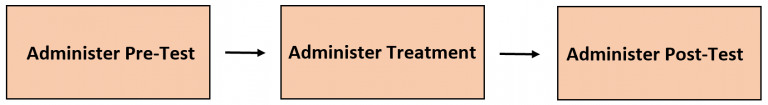
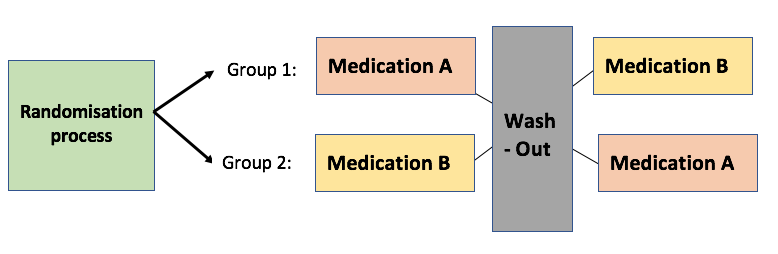
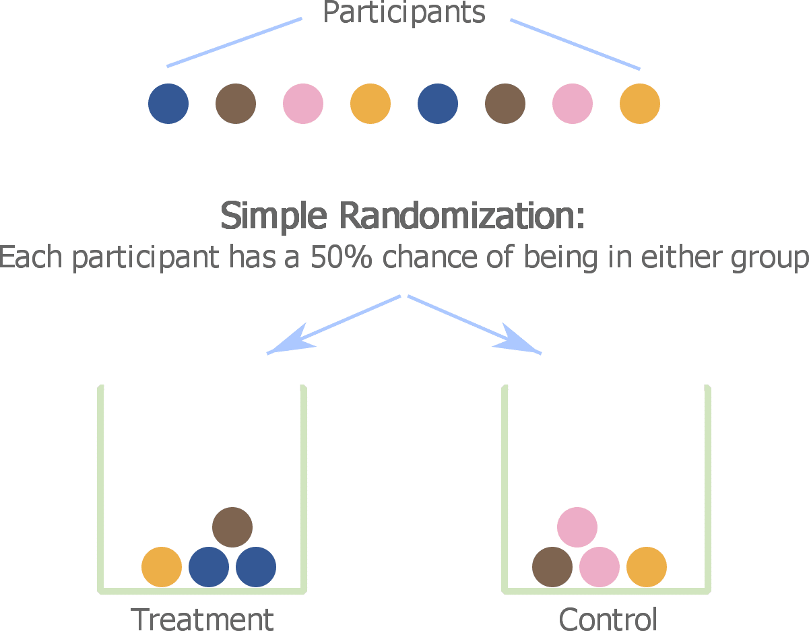
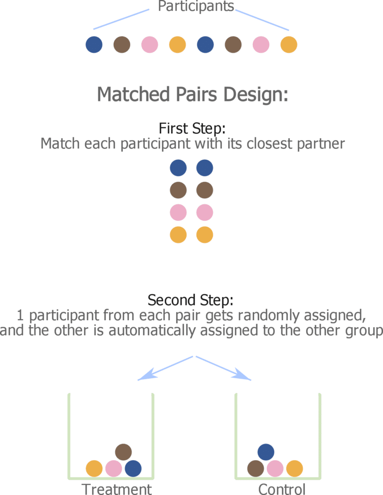

```{r setup, include=FALSE}
options(htmltools.dir.version = FALSE)
knitr::opts_chunk$set(comment     = NA,
                      cache       = TRUE,
                      echo        = TRUE, 
                      warning     = FALSE, 
                      message     = FALSE,
                      fig.align   = "center",   # center all figures
                      fig.width   = 6.5,        # set default figure width to 4 inches
                      fig.height  = 4.5)        # set default figure height to 3 inches
```

class: center, middle

## "…we are suffering from a plethora of surmise, conjecture, and hypothesis. The difficulty is to detach the framework of fact *– of absolute undeniable fact –* from the embellishments of theorists and reporters."

#### - Sherlock Holmes, *Silver Blaze*


---
## Compare Two Means 


### Independent Groups *t*-Test

- Assumes two .bluer["Simple Random Samples"] (SRS)

- Each sample is at least **representive** of its corresponding population

- All members of **EACH** the samples are .dcoral[**INDEPENDENT**] of all others

- .nicegreen[**There is no connection between members of the two samples**]

--

<br><br>

### Dependent Groups *t*-Test

- The assumption of .dcoral[**independence**] has been VIOLATED, resulting in a .nicegreen[**DEPENDENCY*]* across groups

- Variance of DV smaller as groups consist of same or closely matched cases


---

## "All models are wrong, some models are useful."

The first record of .nicegreen[George Box] saying **"all models are wrong"** is in a 1976 paper published in the *Journal of the American Statistical Association*. The 1976 paper contains the aphorism twice. The two sections of the paper that contain the aphorism are copied below.

<br>

--
**Parsimony**

Since all models are wrong the scientist cannot obtain a "correct" one by excessive elaboration. On the contrary following .nicegreen[William of Occam] he should seek an economical description of natural phenomena. Just as the ability to devise .dcoral[simple but evocative models] is the signature of the great scientist so .bluer[overelaboration] and .bluer[overparameterization] is often the mark of mediocrity.


--

**Worrying Selectively**

Since all models are wrong the scientist must be alert to .dcoral[what is importantly wrong]. It is inappropriate to be concerned about mice when there are tigers abroad.


--
.centered[.dcoral[.large[
**IF** there is correlation, **THEN** your model should leverage it!
]]]


---

**Observational - Longitudinal Repeated Measures: Collect Same Measure Before-and-After**

Dr. Filburn wishes to assess the **effectiveness** of a leadership workshop for 60 middle managers. The 60 managers are rated by their immediate supervisors on the Leadership Rating Form (LRF), .coral[before] **and** .nicegreen[after] the workshop.


--

**Observational - Repeated Measures: Simultaneously Collected Different Measures**

Dr. Clarke is interested in determining if workers are more concerned with job security **or** pay. He gains the cooperation of 30 individuals who work in different settings and asks each employee to rate his or her concern about .coral[salary level] **and** .nicegreen[job security], on a scale from 1 to 10.


--

**Observational - Pairs: Pre-existing**

Dr. Gale questions whether husbands **or** wives with infertility problems feel equally anxious. She recruits 24 infertile couples and then administers the Infertility Anxiety Measure (IAM) to both the .coral[husbands] **and** the .nicegreen[wives].

--

**Experimental - Matched Pairs: Randomized within dyads**

Dr. Smith has developed a new strategy for teaching fractions to second graders.  **Before** assigning the 30 students to receive group instruction either by the .coral[old way] **and** .nicegreen[new way], the researcher first matches the students into pairs with similar prior math achievement.  One randomly selected student in each pair is selected to receive the new method while the other is taught be the old method.


---

<!-- ProfessorWolfe: Three Types of t Tests (2 min)-->

<iframe width="1000" height="750" src="https://www.youtube.com/embed/4VdXSXfrBTw?controls=0&amp;start=2" frameborder="0" allow="accelerometer; autoplay; encrypted-media; gyroscope; picture-in-picture" allowfullscreen></iframe>


---
## Comparing Means: Matched or Paired *t*-Test

> What is the difference from an independent groups *t*-Test?

.pull-left[
**Incorporation of Correlation**


- eliminates variance from .dcoral[extraneous factors]

- The stronger the correlation, the smaller the variability in the difference scores

- The denominator of the *t*-statistic is smaller


**observed *t* value =  MORE EXTREME**

]

--

.pull-right[
**Reduction in Degrees of Freedom**

Sample size is the number of .dcoral[PAIRS] not the number of observations.

- The degrees of freedom are half

**critical *t* = little more extreme**

]

--


.nicegreen[.large[
> **IF** there is correlation...  
>   
> **THEN** a matched/paired *t*-Test is more **powerful** than ignoring the correlation and erroneously performing an independent-groups *t*-Test.

]]

---


## Observational Studies

.dcoral[**Pre-existing Pairs**] - naturally *related*, *correlated*, or *dependent* based on the .nicegreen[**nature of the situation**]

- married couples madeup of husbands & wives
- parent-child dyads
   
--

<br><br>

.dcoral[**Repeated Measures**] - a single sample where each person has .nicegreen[**two measurements**]    


.pull-left[
- **Before-&-After** study of the same measure  
   
- Same measure under **different stimuli**
   
- Different measures administered **successively**  
   
- Different measures administered **simultaneously**  
]

.pull-right[
- math achievement pre-test & post-test    

- balance *'sway'* measured in the dark & light  

- Depression inventory & Anxiety inventory  

- Conner's ADHD Scale: sub-scores for inattention & hyperactivity

]

---
### Observational Studies: Before-&-After Design

```{r,echo=FALSE, out.width = "70%"}

```

.large[
> Because there is .nicegreen[**No control group**]and .nicegreen[**Only 2 time points**]
]

- .dcoral[History] – Experiences outside the study may affects the measurements before and after a treatment

- .dcoral[Maturity] – Biological changes in participants affect the measurements before and after a treatment

- .dcoral[Attrition] – Any individual that leaves the study before a post-measurement can be taken is excluded

- .dcoral[Regression to the mean] – People who score extremely high or low on some measurement have a tendency to score closer to the average next time, despite the treatment they partake in.

- .dcoral[All change is TRUE change] - measurements have random fluctuation/error 

- .dcoral[Ceiling and Floor effects] - If before or after scores are skewed, then the change scores will not be normally distributed


---
### Repeated-Measures: Successive designs non-longitudinal


- **Cross-over designs** each participant gets **BOTH** conditions
   - Order effects? like fatigue or learning
   - IF so, .dcoral[counterbalance] order
    
--

```{r,echo=FALSE, out.width = "80%"}

```

--

- .dcoral[**Counterbalancing**] random subset of cases 
    - Half get: A then B
    - Half get: B then A
    - May not eliminate **carry-over effects**
    - May need a **Wash-out period**


---

## Experimental Studies: Cross-over Design


**Why Bother?**

Both "groups" are made up of the same participants, so in a way .nicegreen[each subject acts as their own control].

- minimizes the risk of confounding   

- requires .dcoral[less study participants] than 2 independent groups

--

<br>

**Potential Problems**

Each study .dcoral[participant is required to do twice as much].  This can lead to .nicegreen[fatigue and attrition].

- hard to know **how long** the .dcoral[wash-out period] should be   

- risk of **lingering** .dcoral[carry-over effects], effects might not fully wash-out ever   

- entire process takes .dcoral[more time!]

---

.pull-left[
### Simple Randomization

> Use an Indepdended groups *t*-Test

```{r,echo=FALSE, out.width = "70%"}

```
<br><br>

For example, a lot of outcomes are gender and age specific. Therefore, matching individuals on these 2 variables will help .dcoral[improve the validity of the study by reducing bias].
]

--

.pull-right[
### Matching Pairs Design

> Use a Matched-Pairs *t*-Test

```{r,echo=FALSE, out.width = "70%"}

```

]


---


## Experimental Studies: The Matched Pairs Design


**Potential Problems**

- What characteristics are .dcoral[relevant] to match on?  How .dcoral[many] variables should you match no? Can they be .dcoral[reliably measured]?

- Does your sample contain participants that .dcoral[actually match well]?  The more variables you match on, the higher the risk some people will be poorly matched up or not even match anyone.  

- You must exclude people who do not have a .nicegreen[*'good match'*], thus reducing your sample size used and statistical power.

- You can not randomize subjects in rolling-enrollment.  You must .dcoraql[wait] till all subjects are enrolled and you have gathered the matching variables BEFORE you can randomize into groups.

.large[
> Picking the wrong matching variables is problematic as it is .dcoral[**irreversible**]. In other words, we CANNOT explore alternative causal hypotheses since the design is definitive and CANNOT be changed.
]
---

<!-- CrashCourse Stats: #27 t-Tests: A Matched Pair Made in Heaven (11 min)-->

<iframe width="1000" height="750" src="https://www.youtube.com/embed/AGh66ZPpOSQ?controls=0&amp;start=2" frameborder="0" allow="accelerometer; autoplay; encrypted-media; gyroscope; picture-in-picture" allowfullscreen></iframe>


---

```{r,echo=FALSE, out.width = "85%"}
knitr::include_graphics("figures/formula_sheet_p1_2samples.jpg")
```


---

```{r,echo=FALSE, out.width = "85%"}
knitr::include_graphics("figures/formula_sheet_p1_matched.jpg")
```


---
.pull-left[
### .dcoral[Direct Difference Approach]

- **Variables**: subtract each pair of values
    + Person 1: $D = x_1 - x_2$
    + Person 2: $D = x_1 - x_2$
    + Person 3: $D = x_1 - x_2$
    + $\dots$
    
   
- **Summary Stats**: for the .dcoral[DIFFERENCES]
    + M: $\overline{D}$
    + SD: $s_D$
    + *correlation is just descriptive*
    
- **Test Statistic**:  .dcoral[*regular* One-Sample t-Test]    
    +  Degrees of Freedom: $df = n - 1$
    
$$t=\frac{\overline{D}-\mu_0}{\frac{s_D}{\sqrt{n}}}$$    
    

]

--

.pull-right[
### .nicegreen[Correlation Approach]

- **Variables**: keep the values separate
  + Person 1: $x_1$, $x_2$
  + Person 2: $x_1$, $x_2$
  + Person 3: $x_1$, $x_2$
  + $\dots$
    
- **Summary Stats**: for .nicegreen[EACH VARIABLE]
    + M: $\overline{x_1}$, $\overline{x_2}$
    + SD: $s_1$, $s_2$
    + COR: $r$
    
- **Test Statistic**:   .nicegreen[*adjusted* Two-Sample t-Test]   
    + Degrees of Freedom: $df = n - 1$

$$t=\frac{\overline{D}-\mu_0}{\sqrt{\frac{s_1^2 + s_2^2}{n}- \frac{2rs_1s_2}{n}}}$$ 


]

---

<!-- Marin Stats Lectures: Paired t-Test (15 min)-->

<iframe width="1000" height="750" src="https://www.youtube.com/embed/Q0V7WpzICI8?controls=0&amp;start=2" frameborder="0" allow="accelerometer; autoplay; encrypted-media; gyroscope; picture-in-picture" allowfullscreen></iframe>


---
class: inverse, center, middle

# Let's Apply This to the Cancer Dataset 

### Testing normality in the population, based on a sample


---
# Read in the Data

```{r, echo=FALSE}
library(DT)
```


```{r}
library(tidyverse)    # Loads several very helpful 'tidy' packages
library(haven)        # Read in SPSS datasets
library(furniture)    # Nice tables (by our own Tyson Barrett)
library(psych)        # Lots of nice tid-bits
```

```{r, eval=FALSE}
cancer_raw <- haven::read_spss("cancer.sav")
```

```{r, include=FALSE}
cancer_raw <- haven::read_spss("data/cancer.sav")
```

--
### And Clean It

```{r, message=FALSE, warning=FALSE}
cancer_clean <- cancer_raw %>% 
  dplyr::rename_all(tolower) %>% 
  dplyr::mutate(id = factor(id)) %>% 
  dplyr::mutate(trt = factor(trt,
                             labels = c("Placebo", 
                                        "Aloe Juice"))) %>% 
  dplyr::mutate(stage = factor(stage))
```


---

## The Cancer Dataset

- `id` indicates the participant number
- `totalcin` as the first measurement, a.k.a. the **pre-test**
- `totalcw6` as the last measurement, a.k.a. the **post-test**

> IGNORE all other variables and other time points for now...

```{r, echo=FALSE, message=FALSE, warning=FALSE}
cancer_clean %>% 
  DT::datatable(options = list(pageLength = 5))
```


---

### Example 1) Data Wrangling - Create a "DIFFERENCE" score

- a.k.a. "CHANGE SCORE" (restrict to complete data)

> One line PER PERSON...time points side-by-side on the same line

```{r}
cancer_new <- cancer_clean %>% 
  dplyr::mutate(totalc_diff = totalcw6 - totalcin) %>% 
  dplyr::filter(complete.cases(totalcin, totalcw6)) %>% 
  dplyr::select(id, totalcin, totalcw6, totalc_diff)
```

```{r, echo=FALSE, message=FALSE, warning=FALSE}
cancer_new %>% 
  DT::datatable(options = list(pageLength = 5))
```


---

### Example 1) Data Wrangling - Restructure to "LONG" format

> One line PER TIME POINT per person...each person will have TWO lines

```{r}
cancer_long <- cancer_new %>% 
  tidyr::pivot_longer(cols = c(totalcin, totalcw6),
                      names_to = c(".value", "time"),
                      names_pattern = "(.*)(..)") %>% 
  dplyr::mutate(time = factor(time) %>% 
                  forcats::fct_recode("Intake" = "in",
                                      "Week 6" = "w6"))
```


```{r, echo=FALSE, message=FALSE, warning=FALSE}
cancer_long %>% 
  DT::datatable(options = list(pageLength = 5))
```


---

### Example 1) Both Time points: Histograms & Boxplots


.pull-left[

**Separate Histograms**
 
> Ignores Pairing!

```{r histoboth, echo=FALSE}
cancer_long %>% 
  ggplot(aes(x = totalc)) +
  geom_histogram(aes(y=..density..),
                 binwidth = 1,
                 alpha = .8) +
  geom_density(aes(color = "Density")) +
  facet_wrap(~ time, ncol = 1) +
  geom_vline(data = cancer_long %>% 
               dplyr::group_by(time) %>% 
               dplyr::summarise(M_totalc = mean(totalc, 
                                                na.rm = TRUE)),
             aes(xintercept = M_totalc,
                 color = "Mean"),
             size = 2) +
  theme_bw() +
  labs(x = "Total Oral Condition",
       color = NULL) +
  scale_color_manual(values = c("blue", "red")) +
  theme(legend.position = c(1, 1),
        legend.justification = c(1.1, 1.1),
        legend.background = element_rect(color = "black"))
```


]

.pull-right[

**Side-by-Side Boxplots**

> Ignores pairing!

```{r, echo=FALSE}
cancer_long %>% 
  ggplot(aes(x = time,
             y = totalc)) +
  geom_boxplot(fill = "gray") +
  stat_summary(fun = mean,
               geom = "point",
               color = "red",
               size = 5,
               shape = 18) +
  theme_bw() +
  labs(x = NULL,
       y = "Total Oral Condition") 
```


]


---


### Example 1) Both Time points: Line Plot and Scatter Plot


.pull-left[

**Line Plot for Paired t-Test**
 
> Is there a Mean Difference?  Looks like yes

```{r, echo=FALSE}
cancer_long %>% 
  ggplot(aes(x = time,
             y = totalc)) +
  geom_violin(fill = "gray") +
  geom_point() +
  geom_line(aes(group = id)) +
  stat_summary(fun = mean,
               geom = "point",
               color = "red",
               size = 5,
               shape = 18) +
  stat_summary(aes(group = 1),
               fun = mean,
               geom = "line",
               color = "red",
               size = 1,
               shape = 18) +
  theme_bw() +
  labs(x = NULL,
       y = "Total Oral Condition") 
```

]

.pull-right[

**Scatter Plot for Correlation/Regression**
 
> Is there a Correlation? Looks like no

```{r, echo=FALSE}
cancer_new %>% 
  ggplot(aes(x = totalcin,
             y = totalcw6)) +
  geom_point() +
  geom_smooth(method = "lm") +
  theme_bw() +
  labs(x = "Total Oral Condition at Intake",
       y = "Total Oral Condition at Six Weeks")
```


]


---

### Example 1) Change Scores: Histograms & Boxplots

.pull-left[

**Histogram of Change in Scores**

```{r, echo=FALSE}
cancer_new %>% 
  ggplot(aes(totalc_diff)) +
  geom_histogram(aes(y=..density..),
                 binwidth = 1,
                 alpha = .8) +
  geom_density(aes(color = "Density")) +
  geom_vline(xintercept = 0,
             linetype = "dashed") +
  geom_vline(data = cancer_long %>% 
               dplyr::summarise(M_totalc_diff = mean(totalc_diff, 
                                                na.rm = TRUE)),
             aes(xintercept = M_totalc_diff,
                 color = "Mean"),
             size = 2) +
  theme_bw() +
  labs(x = "Total Oral Condition",
       color = NULL) +
  scale_color_manual(values = c("blue", "red"))  +
  theme(legend.position = c(1, 1),
        legend.justification = c(1.1, 1.1),
        legend.background = element_rect(color = "black"))
```


]


.pull-right[

**Boxplot of Change in Scores**

```{r, echo=FALSE}
cancer_new %>% 
  ggplot(aes(x = "test",
             y = totalc_diff)) +
  geom_boxplot(fill = "gray") +
  stat_summary(fun = mean,
               geom = "point",
               color = "red",
               size = 5,
               shape = 18) +
  theme_bw() +
  labs(x = NULL,
       y = "Change in Total Oral Condition")  +
  geom_hline(yintercept = 0,
             linetype = "dashed")
```


]


---
### Example 1) Summary Statistics


.pull-left[
**Means and Standard Deviations**

```{r}
cancer_new %>% 
  furniture::table1("Pre" = totalcin, 
                    "Post" = totalcw6,
                    "Change" = totalc_diff,
                    digits = 2)
```


]

--

.pull-right[

**Pearson's Product-Moment Correlation**

```{r}
cancer_new %>% 
  cor.test(~ totalcin + totalcw6,
           data = .)
```

]


---

### Example 1) Direct Difference Method (Ch 7. 1-sample test)


```{r directdif, eval=FALSE}
cancer_new %>% 
  dplyr::pull(totalc_diff) %>% 
  t.test(mu = 0)
```

--

```{r, ref.label="directdif", echo=FALSE}

```


--

**Interpretation**

--

> The 23 participants' oral condition was measured as intake (*M* = 6.48, *SD* = 1.56) and re-evaluated six weeks later (*M* = 9.48, *SD* = 3.49).  A paired samples t-Test on the repeated measures (*r* = .098) found a this to be a statistically significantly deterioration, *t*(22) = 3.91, *p* < .001, 95% *CI* [1.41, 4.59].


---

### Example 1) Paired t-Test Method (adjust indept t-test)

.pull-left[
```{r pairt, eval=FALSE}
cancer_long %>% 
  t.test(totalc ~ time,  # DV_cont ~ IV_time
         data = .,
         paired = TRUE)
```
]

--

.pull-right[
```{r, ref.label="pairt", echo=FALSE}

```
]


--

**Interpretation**

--

> The 23 participants' oral condition was measured as intake (*M* = 6.48, *SD* = 1.56) and re-evaluated six weeks later (*M* = 9.48, *SD* = 3.49).  A paired samples t-Test on the repeated measures (*r* = .098) found a this to be a statistically significantly deterioration, *t*(22) = 3.91, *p* < .001, 95% *CI* [1.41, 4.59].


.dcoral[**NOTE** *We usually report positive values for the test statistic (t), as well as the confidence interval values.*]


---

### Example 1) 1-Sided Alternative and CIs

.pull-leftsmall[
```{r twoside, eval=FALSE}
cancer_long %>% 
  t.test(totalc ~ time, 
         data = .,
         alternative = "two.sided",
         paired = TRUE)
```


<br><br>

```{r oneside, eval=FALSE }
cancer_long %>% 
  t.test(totalc ~ time,
         data = .,
         alternative = "less",
         paired = TRUE)
```

.dcoral[**NOTE** You MUST use the 2-sided test to get a meaningful Confidence Interval!]

]

.pull-rightbig[

```{r, ref.label="twoside", echo=FALSE}

```

```{r, ref.label="oneside", echo=FALSE}

```

]


---

### Example 1) Effect Size: Cohen's d for MATCHED samples

> This will be .dcoral[**bias**] for the populations effect size when based on sample data

--

.pull-left[
Step 1) Compute Cohen's d as IF we had independent samples

$$d_{orig} = \frac{\overline{D}}{SD_{diff}}\tag{8.2}$$

```{r}
d =3/(3.68)   
d
```

]

--

.pull-right[

Step 2) Adjust for the correlation between measures (lack of independence)

$$d_{matched} = d_{orig} \sqrt{\frac{1}{2(1 - \rho)}}\tag{11.5}$$

```{r}
d*sqrt(1/(2*(1 - .098)))
```

]

--

<br><br>

**Interpretation**

--

> After accounting for correlation between repeated-measures, the oral condition increased by 0.61 standard deviations. 


---

### Example 1) Effect Size: Hedge's g for MATCHED samples


> This will be LESS bias for the populations effect size when based on sample data


--

$$g_{matched} = t \sqrt{\frac{1}{n}}\tag{11.6}$$
--

```{r}
3.9092*sqrt(1/23)
```


--

<br><br>

**Interpretation**

--

> After accounting for correlation between repeated-measures, the oral condition increased by 0.82 standard deviations. 


--

.dcoral[**Read the paragraph at the end of page 351 (after formula 11.6)!**]

Please correctly label your effect size!


---
class: inverse, center, middle

# Questions?


---
class: inverse, center, middle

# Next Topic

### One-Way ANOVAs