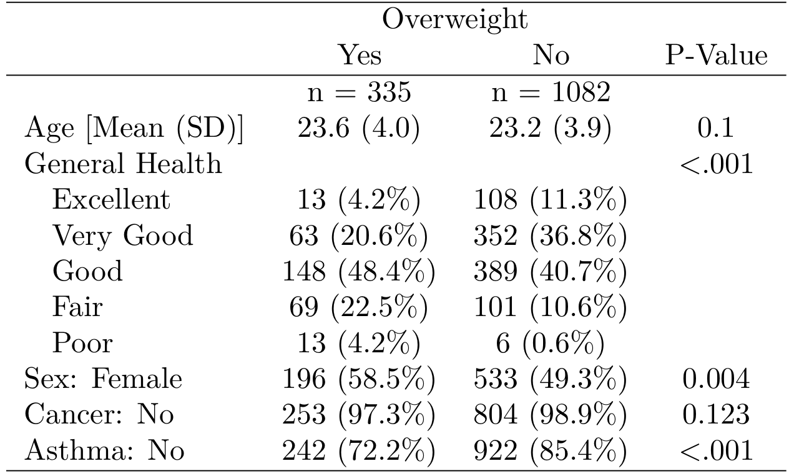

```{r setup, include=FALSE}
options(htmltools.dir.version = FALSE)
```

class: inverse, middle, center

# Background Information

---
background-image: url(figures/fig_scale_variable.png)
background-position: 50% 80%
background-size: 600px

# Scale vs. Variable


---
# Scale vs. Variable

.pull-left[
## MEASUREMENT SCALE

.large[
- .coral[Nominal] = named groupings, no meaningful order
- .dcoral[Ordinal] = groupings that do have natural order
- .nicegreen[Interval] = precise units that are equally spaced
- .bluer[Ratio]	= interval + true zero point
]]

.pull-right[
## VARIABLE TYPE

.large[
- .coral[Categorical] = finite, countable number of levels, no intermediate values possible	
- .nicegreen[Numeric] = infinite intermediate values are possible, at least in theory
]

*NOTE: due to limits on measurement precision, observed data may be discrete, even though the underlying construct is continuous*
]

---
background-image: url(figures/fig_obs_exp.jpg)
background-position: 50% 90%
background-size: 900px

# Observational vs. Experimental


---
# Rounding Numbers

### Rules

.large[
- If you want to round to N decimal places, look at the digit in the $N + 1$ place…
    - If it is LESS than 5 -> do not change the digit in the Nth place
    - If it is MORE than 5 -> increase the digit in the Nth place by 1
    - If it is EQUAL to 5 AND there are no non-zero digits to the right, -> increase the digit in the Nth place by 1 ONLY IF the Nth digit is ODD (do not change it if it is EVEN)

In all cases, the last step is to drop the digit in the $N+1$ place and other digits to the right
]


--

.center[.huge[.coral[Examples]]]

???

Round to two decimal places

- $65.3 = 65.30$
- $8/3 = 2.67$
- $0.4255 = 0.43$
- $0.4358 = 0.44$
- $0.425 = 0.42$
- $0.435 = 0.44$


---
background-image: url(figures/fig_summation_notation.png)
background-position: 50% 50%
background-size: 500px

# Summation Notation

<br><br><br><br><br><br><br><br><br><br><br><br><br>

.center[.Huge[.coral[Examples]]]

???
Some examples up on the board:

$$
\frac{1}{5}\sum_{i = 1}^5 x_i
$$

$$
\sum_{i = 1}^2 (x_i + y_i)
$$

$$
\sum_{i = 1}^n y_i
$$

$$
\sum_{i = 1}^2 (x_i \times y_i)
$$

---
# Summation Rules

.pull-left[
#### Number 1
$$
\sum (X_i + Y_i) = \sum X_i + \sum Y_i
$$
$$
\sum (X_i - Y_i) = \sum X_i - \sum Y_i
$$

#### Number 2
$$
\sum_{i=1}^n C = nC
$$


#### Number 3
$$
\sum CX_i = C \sum X_i
$$
]

--

.pull-right[
#### Number 4

$$
\sum (X_i \times Y_i) \neq \sum X_i \times \sum Y_i
$$
]

---
class: inverse, middle, center

# Intro to R

---
# Download `R` and `RStudio`

<br>

.huge[If `R` is like a car's engine, then `RStudio` is the steering wheel, the pedals, and the comfortable seat]

--
.pull-left[.huge[.center[
`R`

[www.r-project.org](https://cran.cnr.berkeley.edu/)
]]]

.pull-right[.huge[.center[
`RStudio`

[www.rstudio.com](https://www.rstudio.com/products/rstudio/download/)
]]]

---
# Focus on what is needed in `R`

<br>

.center[.Huge[
".dcoral[Success] is neither magical nor mysterious. Success is the natural consequence of consistently applying the .nicegreen[basic fundamentals]." --- Jim Rohn
]]

.footnote[https://www.brainyquote.com/quotes/jim_rohn_122132?src=t_fundamentals]


---
# Intro to `R`

.pull-left[.huge[
Why Use `R`?
]
.large[
- .coral[**Free**]
- Almost always up-to-date
- Best .bluer[data visualizations]
- .nicegreen[Syntax oriented] (easy to reproduce analyses)
- Gets updated regularly
- You can make your .gray1[own functionality] (e.g., `table1()`)
]]

--

.pull-right[
.huge[`table1()` produces 👇] 
<br>

]


---
count: false
# Intro to `R`

.pull-left[.huge[
Why Use `R`?
]
.large[
- .coral[**Free**]
- Almost always up-to-date
- Best .bluer[data visualizations]
- .nicegreen[Syntax oriented] (easy to reproduce analyses)
- Gets updated regularly
- You can make your .gray1[own functionality] (e.g., `table1()`)
]]

.pull-right[.huge[
Any Issues?
]
.large[
- Learning curve
- Too extensive (people often focus on too much)
- Advisor's sometimes don't use it

The pro's heavily outweight the con's *if* you are willing to use it. It can save you tons of time in the long-run.
]]

---
.pull-left[
## .coral[Objects]

.large[.large[
Virtual objects are like physical objects (e.g., a car is good to travel in, a table not so much)

`R` uses virtual objects (`data.frame`, `vectors`)
]]

```{r, eval=FALSE}
x <- 5
```
```{r, eval=FALSE}
x = 5
```

]

--

.pull-right[
## .bluer[Vectors] and .nicegreen[Data Frames]

.large[.large[
- a `vector` is a single variable (can be numeric, character, or factor)
- a `data.frame` is a group of vectors (variables)
]]

```{r, echo=FALSE}
df <- data.frame(
  x = c(5,3,4,1),
  y = c(1,1,0,0)
)
```

```{r, comment=">"}
df
```

]

---
# Functions

.huge[Its how we do stuff in `R`]

.pull-left[.large[

Generally looks like:

- `stuff(arg1, arg2)`
    - `stuff` is the function's name
    - `()` surround the arguments that go in the function
    -`arg1` etc. are the pieces of information we give a function
]]

--

.pull-right[
.large[Here's an example of the "mean" function:

- Using our `df` data.frame from before
    - we grab a single variable from `df` using `$`
- `mean()` wants a single variable and it provides the average
]
```{r}
## This is a comment
mean(df$x)
```
]

---
# Important first steps in `R`

.large[.large[
1. Read in Data
2. Quickly assess the data
3. Clean the data
4. Analyze the data
]]

--

.large[We'll show each of these over the next few weeks starting with reading in, assessing and cleaning the data]


---
# Read in the data

.huge[Data comes in various files:]

.pull-left[.large[
- CSV
- tab-delimited
- SPSS
- Excel
]]
.pull-right[.large[
- SAS
- Stata
- Mplus
- etc.
]]

--
### `R` can read all types

--

.huge[Generally, it all works in a similar way]

---
# Read in data


- .large[If your data is called `my_data_file.csv`, then:]

```{r, eval = FALSE}
my_data <- rio::import("my_data_file.csv")
```

--

- .large[If your data is called `my_data_file.txt` (and is tab-delimited), then:]

```{r, eval = FALSE}
my_data <- rio::import("my_data_file.txt", sep="\t", header=TRUE)
```

--

- .large[If your data is an SPSS file, then:]

```{r, eval = FALSE}
my_data <- rio::import("my_data_file.sav")
```

---
background-image: url(figures/fig_inho_data_desc.png)
background-position: 50% 90%
background-size: 800px

# Let's use the data from the book


---
# Steps for .dcoral[Preparing] the Data for Analysis

.large[.large[
1. .coral[Get the data]
2. .nicegreen[Prep the data]
    - Variable Labels 	
    - Value Labels	
    - Missing Values
3. .bluer[Compute] new variables and values (fill in missing codes, recode scores, categorize/group values, combine)
4. Get .dcoral[descriptives] using `tableF()` and `table1()` from the `furniture` package to check what is going on
]]

---
# Step 1: Get the data

```{r, eval=FALSE}
## Data is in .sav form (SPSS)
library(rio)
d <- rio::import("Data/Ihno_dataset.sav")
d
```

```{r, echo=FALSE}
library(rio)
d <- rio::import("~/GoogleDrive/3 Teaching/EDUC 6600/Data/Ihno_dataset.sav")
d
```


---
# Step 2: Prep the data

```{r, message=FALSE, warning=FALSE}
## install.packages("tidyverse")
library(tidyverse)
d_clean <- d %>%
  mutate(Major = factor(Major, labels = c("Psychology", "Premed",
                                          "Biology", "Sociology",
                                          "Economics"))) %>%
  mutate(Coffee = factor(Coffee))
d_clean
```


---
# Step 3: Compute new variables/values

```{r}
d_clean <- d_clean %>%
  mutate(newVar = Mathquiz/2)
```
*Note that I removed the other variables just to show you but in reality all the variables are still there
```{r, echo=FALSE}
tibble(Mathquiz = d_clean$Mathquiz, 
           newVar = d_clean$newVar)
```


---
# Step 4: Get descriptives

.pull-left[
```{r, message=FALSE, warning=FALSE}
library(furniture)
tableF(d_clean, Major)
```
]

.pull-right[
```{r, message=FALSE, warning=FALSE}
tableF(d_clean, Phobia)
```
]


---
# Step 4: Get descriptives

```{r}
library(furniture)
library(dplyr)
d_clean %>% 
  dplyr::group_by(Major) %>% 
  table1(Mathquiz, Phobia, Coffee)
```

---
class: inverse, center, middle

# Questions?


---
class: inverse, center, middle

# Next Topics

### More Data Manipulation
### Understanding Data via Figures


