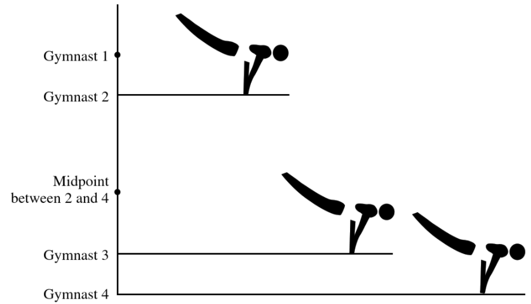
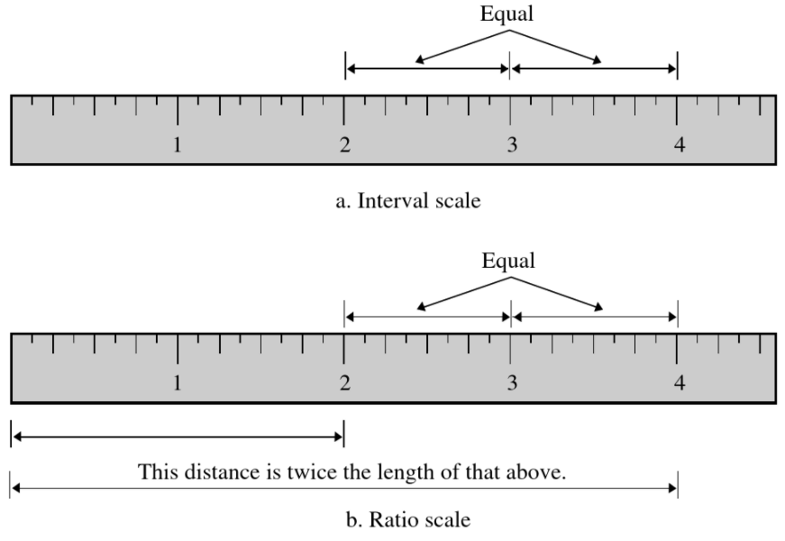
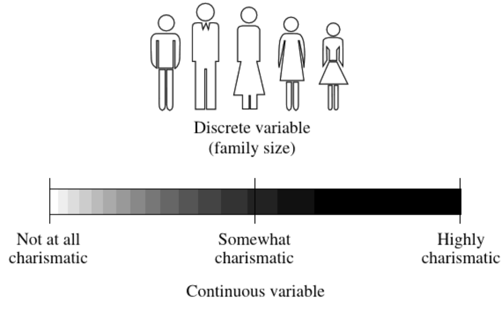

```{r setup, include=FALSE}
options(htmltools.dir.version = FALSE)

knitr::opts_chunk$set(comment     = ">",
                      echo        = TRUE)
```


background-image: url(figures/fig_scale_variable.png)
background-position: 50% 80%
background-size: 600px

# Scale vs. Variable


---
# Scale vs. Variable

.pull-left[
## MEASUREMENT SCALE

.large[
- .coral[Nominal] = named groupings, no meaningful order
- .dcoral[Ordinal] = groupings that do have natural order
- .nicegreen[Interval] = precise units that are equally spaced
- .bluer[Ratio]	= interval + true zero point
]]

.pull-right[
## VARIABLE TYPE

.large[
- .coral[Categorical or Discrete] = finite, countable number of levels, no intermediate values possible	
- .nicegreen[Numeric or Continuous] = infinite intermediate values are possible, at least in theory
]

*NOTE: due to limits on measurement precision, observed data may be discrete, even though the underlying construct is continuous*
]


---

## Ordinal, Interval, Ratio

- .dcoral[Ordinal] = groupings that do have natural order
- .nicegreen[Interval] = precise units that are equally spaced
- .bluer[Ratio]	= interval + true zero point

.pull-left[

```{r,echo=FALSE}

```

]


.pull-right[

```{r,echo=FALSE}

```

]


---

## Discrete vs. Continuous

- .coral[Categorical or Discrete] = finite, countable number of levels, no intermediate values possible	
- .nicegreen[Numeric or Continuous] = infinite intermediate values are possible, at least in theory


.pull-left[
```{r,echo=FALSE}

```
]

*NOTE: due to limits on measurement precision, observed data may be discrete, even though the underlying construct is continuous*

---

## .coral[Scale Examples]


.pull-left[

### Temperature

* **Nominal**
   + Comfortable vs Uncomfortable
   
* **Ordinal**
   + Ice, Chilly, Comfy, Warm, Hates

* **Interval**
   + Celsius (C)
   + Fahrenheit (F) 

* **Ratio**
   + Kelvin (K)
]


--

.pull-right[

### Depression

* **Nominal**
   + Early onset, Late onset, Chronic
   
* **Ordinal**
   + None, mild, moderate, severe

* **Interval-Ratio'ish**
   + Beck Depression Inventory, average of 21 Likert items each on a scale of 0-3

]


---
background-image: url(figures/fig_obs_exp.jpg)
background-position: 50% 90%
background-size: 900px

# Observational vs. Experimental


---
# Population vs. Sample


**Parameter**

* applies to the entire population

**Statistic**

* calculated from a subset or sample

---
# Parametric vs. Non-parametric Statistics

**Parametric**

* Based on a specific distribution (i.e. normal)
* Interval, ratio scales
* can be mokre powerful
* accuracy influenced by outliers

**Non-parametric**

* ordinal or norminal scores
* NOT base on any specific distribution
* no assumption makes it more flexible


---
# Rounding Numbers

### Rules

.large[
- If you want to round to N decimal places, look at the digit in the $N + 1$ place…
    - If it is LESS than 5 -> do not change the digit in the Nth place
    - If it is MORE than 5 -> increase the digit in the Nth place by 1
    - If it is EQUAL to 5 AND there are no non-zero digits to the right, -> increase the digit in the Nth place by 1 ONLY IF the Nth digit is ODD (do not change it if it is EVEN)

In all cases, the last step is to drop the digit in the $N+1$ place and other digits to the right
]


---

## .coral[Rounding Examples]


Round to **two** decimal places: 

1. 65.302
--
  =  65.30
  
--

2. 65.3
--
  =  65.30
  
--

3. 8/3 = 2.66666666...
--
  = 2.67
   
--

4. 0.4252
--
  = 0.43
   
--

5. 0.4258
--
  = 0.43
    
--

6. 0.425
--
  = 0.42
    
--

7. 0.435
--
  = 0.44


---
background-image: url(figures/fig_summation_notation.png)
background-position: 50% 50%
background-size: 500px

# Summation Notation

---

## .coral[Summation Example 1]

.nicegreen[
$$
\begin{matrix}
x_1 = 5  & x_2 = 4  & x_3 = 3  & x_4 = 2  &  x_5 = 1 \\
y_1 = 10 & y_2 = 20 & y_3 = 30 & y_4 = 40 &  y_5 = 50
\end{matrix}
$$
]


.coral[
$$
\frac{1}{5}\sum_{i = 1}^5 x_i \\
$$
]

--


$$
\frac{1}{5} \times (x_1 + x_2 + x_3 + x_4 + x_5) \\
$$


--


$$
\frac{1}{5} \times (5 + 4 + 3 + 2 + 1) \\
$$

--

$$
\frac{1}{5} \times 15 \\
$$


--

$$
3
$$


---

## .coral[Summation Example 2]

.nicegreen[
$$
\begin{matrix}
x_1 = 5  & x_2 = 4  & x_3 = 3  & x_4 = 2  &  x_5 = 1 \\
y_1 = 10 & y_2 = 20 & y_3 = 30 & y_4 = 40 &  y_5 = 50
\end{matrix}
$$
]

.coral[
$$
\sum_{i = 2}^5 (y_i - x_i)
$$
]

--

$$
(y_2 - x_2)  + ( y_3 - x_3) + ( y_4 - x_4) + ( y_5 - x_5)
$$

--

$$
(20-4)+(30-3)+(40-2)+(50-1)
$$

--

$$
16+27+38+49
$$

--

$$
130
$$


---

## .coral[Summation Example 3]

.nicegreen[
$$
\begin{matrix}
x_1 = 5  & x_2 = 4  & x_3 = 3  & x_4 = 2  &  x_5 = 1 \\
y_1 = 10 & y_2 = 20 & y_3 = 30 & y_4 = 40 &  y_5 = 50
\end{matrix}
$$
]

.coral[
$$
\sum_{i = 1}^2 (x_i \times y_i)
$$
]

--

$$
(x_1 \times y_1 )  + ( x_2 \times y_2 )
$$

--

$$
(5\times10)+(4\times20)
$$

--

$$
50+80
$$

--

$$
130
$$


---

## .coral[Summation Example 4]

.nicegreen[
$$
\begin{matrix}
x_1 = 5  & x_2 = 4  & x_3 = 3  & x_4 = 2  &  x_5 = 1 \\
y_1 = 10 & y_2 = 20 & y_3 = 30 & y_4 = 40 &  y_5 = 50
\end{matrix}
$$
]

.coral[
$$
\sum_{i = 1}^2 (x_i + y_i)^2
$$
]

--

$$
(x_1 + y_1 )^2  + ( x_2 + y_2 )^2
$$

--

$$
(5+10)^2+(4+20)^2
$$

--

$$
15^2+24^2
$$

--

$$
225 + 576
$$

--

$$
801
$$

---
# Summation Rules

.pull-left[
#### Number 1
$$
\sum (X_i + Y_i) = \sum X_i + \sum Y_i
$$

$$
\sum (X_i - Y_i) = \sum X_i - \sum Y_i
$$

#### Number 2
$$
\sum_{i=1}^n C = nC
$$


#### Number 3
$$
\sum CX_i = C \sum X_i
$$
]

--

.pull-right[
#### Number 4

$$
\sum (X_i \times Y_i) \neq \sum X_i \times \sum Y_i
$$
]


]


---
class: inverse, center, middle

# Questions?


---
class: inverse, center, middle

# Next Topics

### More Data Manipulation
### Understanding Data via Figures


