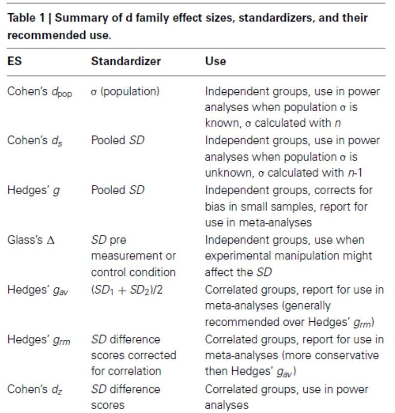
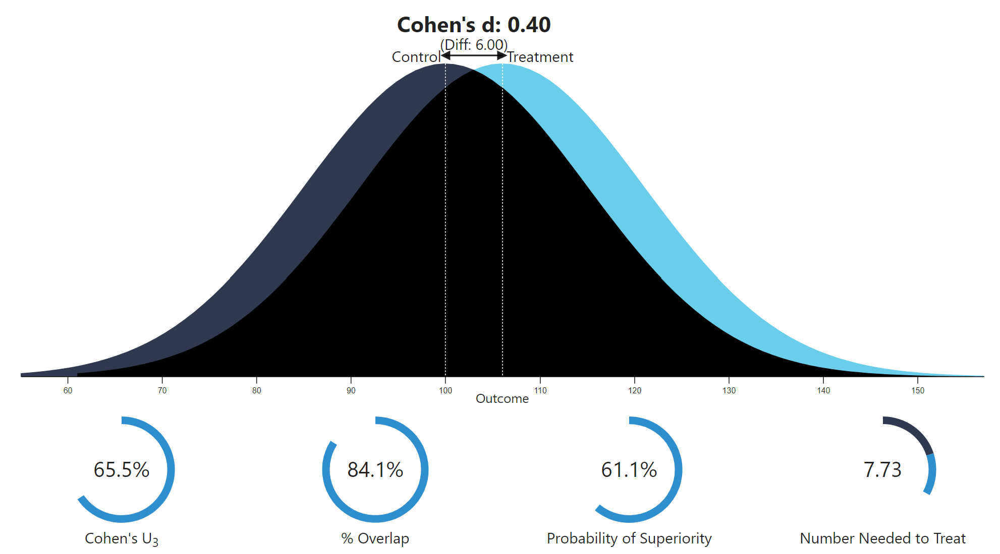
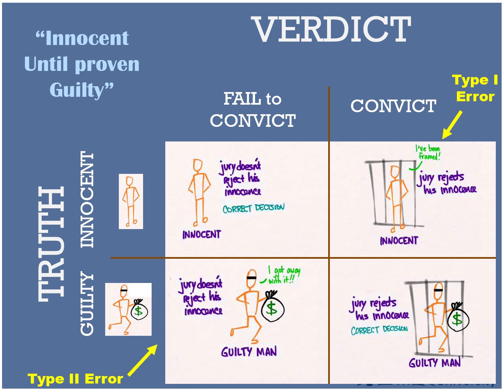
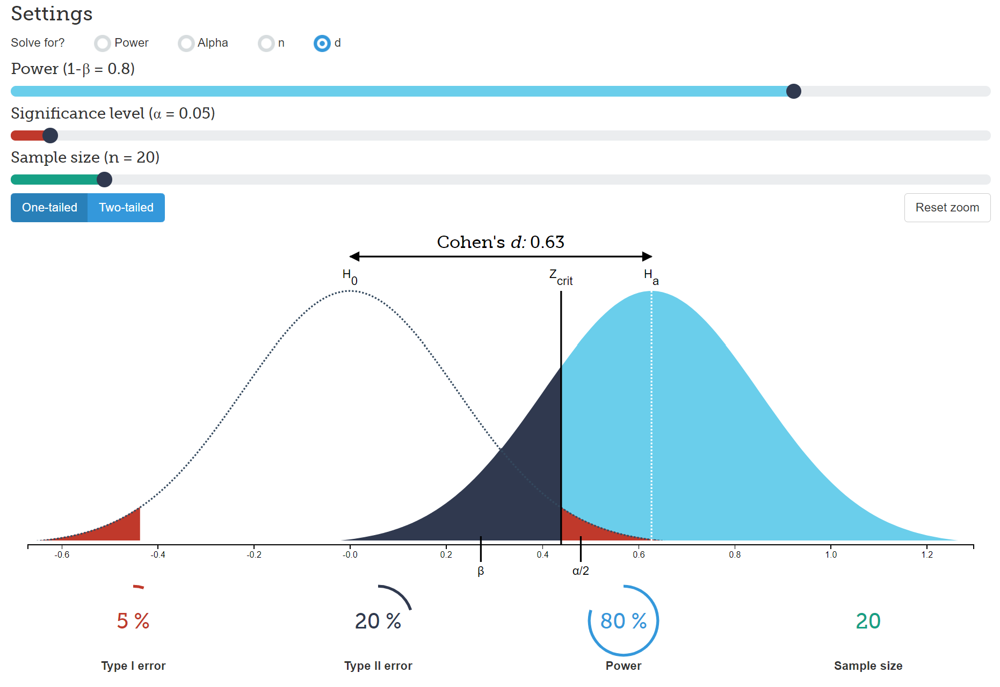

```{r setup, include=FALSE}
options(htmltools.dir.version = FALSE)
knitr::opts_chunk$set(comment     = NA,
                      cache       = TRUE,
                      echo        = TRUE, 
                      warning     = FALSE, 
                      message     = FALSE,
                      fig.align   = "center",   # center all figures
                      fig.width   = 6.5,        # set default figure width to 4 inches
                      fig.height  = 4.5)        # set default figure height to 3 inches
```

class: center, middle


## "I have so heavily emphasized the desirability of working with <br>**few variables and large sample sizes** <br> that some of my students have spread the rumor that my idea of  the **perfect study** is one with 10,000 cases and no variables. <br> **They go too far.** "

### -- Cohen (1990) ["Things I Have Learned (So Far)"](https://tech.me.holycross.edu/files/2015/03/Cohen_1990.pdf) p. 1305


---

## “Next, I have learned and taught that the primary product of research inquiry is one or more measures of **effect size**, not p values.”


### -- Cohen (1994) ["Things I Have Learned (So Far)"](https://tech.me.holycross.edu/files/2015/03/Cohen_1990.pdf) p. 1310

---

## "However, as social scientists move gradually away from reliance on single studies and obsession with null hypothesis testing, **effect size** measures will become more and more popular"

### -- Abelson (1995) ["Statistics as Principled Argument"](https://www.taylorfrancis.com/books/9781410601155) p. 47


---

## P-values Only?

```{r, echo=FALSE, fig.align='center'}
knitr::include_graphics('figures/meme_pval.jpg')
```


---

<!-- Data Demystified: Statistical versus Practical Significance (8 min)-->

<iframe width="1000" height="750" src="https://www.youtube.com/embed/95MyDVxWrO8?controls=0&amp;start=2" frameborder="0" allow="accelerometer; autoplay; encrypted-media; gyroscope; picture-in-picture" allowfullscreen></iframe>


---

<!-- University of Nottingham: What do my results mean Effect size is not the same as statistical significance. With Tom Reader. (6.5 min)-->

<iframe width="1000" height="750" src="https://www.youtube.com/embed/PyNzbDbjs1Y?controls=0&amp;start=2" frameborder="0" allow="accelerometer; autoplay; encrypted-media; gyroscope; picture-in-picture" allowfullscreen></iframe>


---

## Categories of Effect Sizes

--

- Group Differences Indicies
    - Magnitude of difference between 2 groups
    - example: Cohen's *d* (SMD)
    
--
    
- Strength of Association    
   - Magnitude of shard variance between variables
   - example: Pearson's *r*
   
--

- Risk Estimates
    - Compare relative risk for an outcome between 2 groups
    - example: Odds ratio (*OR*)
    
--

- Corrected Estimat3es
    - Correct for sampling error due to smapler sample sizes
    - example: adjusted *R^2*

---

<!-- Top Tip Bio: What Is And How To Calculate Cohen's d? (8 min)-->


<iframe width="1000" height="750" src="https://www.youtube.com/embed/IetVSlrndpI?controls=0&amp;start=2" frameborder="0" allow="accelerometer; autoplay; encrypted-media; gyroscope; picture-in-picture" allowfullscreen></iframe>


---


.pull-left[
## Formula: Cohen's *d* 

$$d = \frac{\mu_1 - \mu_2}{\sigma}$$

Original version: Cohen's $d$ or $d_{pop}$
- should know the population pooled SD, $\sigma$
- if the groups are the SAMLE size, you can use the pooled standard deviation for the samples to use in place of $\sigma$
   - $s_p = \sqrt{\frac{s_1^2 + s_2^2}{2}}$

Sample version: Cohen's $d_s$ 
- uses the samples' pooled standard deviations
- if the groups are **not** the same size, you must weight the samples standard deviations when pooling
    - $s_p = \sqrt{\frac{(n_1-1)s_1^2 + (n_2-1)s_2^2}{n_1-n_2-2}}$

]

--

.pull-right[
```{r, echo=FALSE, fig.align='center'}

```

]

---
<!-- How2stats: Cohen's d vs Hedges g? Explained (3 min)-->

<iframe width="1000" height="750" src="https://www.youtube.com/embed/EaxBaVlftXE?controls=0&amp;start=2" frameborder="0" allow="accelerometer; autoplay; encrypted-media; gyroscope; picture-in-picture" allowfullscreen></iframe>


---
## Guidelines: Cohen's *d* 

--

- .dcoral["Small": *d* = 0.2 thru 0.5]
    - considered too small to differenciate by the naked eye
    - example: difference in heights for 15 and 16 year old girls
    
--
    
- .dcoral["Medium": *d* = 0.5 thru 0.8]
    - just large enough to be seen by the naked eye
    - example: difference in heights for 14 and 18 year old girls
     
--

- .dcoral["Large": *d* > 0.8]
    - really obvious difference between groups
    - example: difference in heights for 13 and 18 year old girls
    
--

> Note: Social sciences often yield small effect sizes, but small effect sizes can have large practical significance   


---
<!-- John Boniello: Effect Size (3 min)-->

<iframe width="1000" height="750" src="https://www.youtube.com/embed/6uYNVCy-8NA?controls=0&amp;start=2" frameborder="0" allow="accelerometer; autoplay; encrypted-media; gyroscope; picture-in-picture" allowfullscreen></iframe>


---
class: inverse

## Interactive Visulatization

[Interpreting Cohen's d Effect Size](https://rpsychologist.com/cohend/)

```{r,echo=FALSE, out.width = "60%"}

```


> Dr. Kristoffer Magnusson, aka "R Psychologist"

> Centre for Psychiatry Research, Karolinska Institutet, Stockholm, Sweden

---

### Example 1) Calculating Cohen's d by hand

.dcoral[Background:] Randomly assigned anorexic young girls to two different treatments & compared their weight

.dcoral[Research Question:] **Are the treatments different?**
 
--


.nicegreen[
```{r, echo=FALSE, results='asis'}
library(tidyverse)
data.frame(Treatment = c("A", "B"),
           n = c(29, 26),
           M  = c(85.7, 81.1),
           SD = c(8.35, 4.74),
           VAR = c(69.7225, 22.4676)) %>% 
  knitr::kable(format = 'html',
               col.names = c("Treatment",
                             "Size (n)",
                             "Mean (M)",
                             "Std Dev (SD)",
                             "Variance")) 
```
]


--
.dcoral[Observed Difference in Means] 

$\bar{D}=\bar{x_1}-\bar{x_2}=85.7-81.1$ = **4.6 pounds** 

--

.dcoral[Pooled Standard Deviation] 

$s_p=\sqrt{\frac{(n_1-1)s_1^2+(n_2-1)s_2^2}{n_1-n_2-2}}=\sqrt{\frac{(28)69.7225+(25)22.4676}{53}}$ = **6.8871 pounds**

--

.dcoral[Effect Size] 

$d_s=\frac{\mu_1-\mu_2}{\sigma}=4.6/6.8871$  = **0.67** 

--

.dcoral[Reporting]


---

.pull-left[

### Select/calculate **BEFORE** collecting any data 

- **Test Statistic**  
    - the critical value
    - cut off point(s) for *z*, *t*, *F*, ect.
    
- **Statistical Significance** 
    - the $\alpha$ level you will use
    - usually $.05$
    
- **Effect Size** 
    - how big you expect the effect to be
    - how big of an effect would be meaningful 
    
- **Power** 
    - given expected effect size, alpha, & n's
    - 1 - $\beta$

]

--

.pull-left[

### Observe/calculate **AFTER** collecting and anlayzing data  

- **Test Statistic**  
    - the observed test statistic from the data 
    - *z*, *t*, *F*, ect.
    
- **Statistical Significance** 
    - the observed p-value from a test
    - give 3 decimal places or *p* < .001
    
- **Effect Size** 
    - how big the effect was in your sample
    - practical significant?
    
- **Power**  
    - did you get statistical significance?
    - avoid "retrospective" or "post hoc" power

]


---

```{r,echo=FALSE, out.width="75%"}

```


---


.pull-leftsmall[.large[
When we conduct a hypothesis test, 
we wither reject or fail to reject the Null Hypothesis.  
Our decision usually causes four outcomes:
]]


.pull-rightbig[

```{r, echo=FALSE, fig.align='center'}
knitr::include_graphics('figures/confusion_matrix.png')
```

]


---

.pull-left[

```{r, echo=FALSE, fig.align='center'}
knitr::include_graphics('figures/preg_type_1.png')
```

* Test Concludes: Reject the Null Hypothesis
* But the Truth is: Null Hypothesis is TRUE

$$
\alpha = Prob(\text{False Positive}) = Prob(p-value< \alpha \;|\; H_0 \text{ is NOT true} )
$$
]

--

.pull-right[

```{r, echo=FALSE, fig.align='center'}
knitr::include_graphics('figures/preg_type_2.png')
```

* Test Concludes: Fail to reject the Null Hypothesis
* But the Truth is: Null Hypothesis is FALSE

$$
\beta = P(\text{False Negative})= Prob(p-value> \alpha \;|\; H_0 \text{ IS true} )
$$

]


---
## POWER = $1 - \beta$

* Reject the Null Hypothesis
* Null Hypothesis is FALSE

> An estimate of power is only as good as the estimate of effect size upon which it is based

…BUT determining the effect size is usually the purpose (or should be) of the experiment. 


---

<!-- StatQuest: Statistical Power, Clearly Explained!!! (8 min)-->

<iframe width="1000" height="750" src="https://www.youtube.com/embed/Rsc5znwR5FA?controls=0&amp;start=2" frameborder="0" allow="accelerometer; autoplay; encrypted-media; gyroscope; picture-in-picture" allowfullscreen></iframe>


---

<!-- StatQuest: Power Analysis, Clearly Explained!!! (16.5 min)-->

<iframe width="1000" height="750" src="https://www.youtube.com/embed/VX_M3tIyiYk?controls=0&amp;start=2" frameborder="0" allow="accelerometer; autoplay; encrypted-media; gyroscope; picture-in-picture" allowfullscreen></iframe>


---


.pull-left[
## Distribution Possible

```{r, echo=FALSE, out.width = "100%", fig.align='center'}
knitr::include_graphics('figures/bell_testimony.gif')
```

Distribution of possible witnesses in a trial **when the accused is innocent**.

Note: [Figures from Tom Rodgers website](http://www.intuitor.com/statistics/T1T2Errors.html)

]

--

.pull-right[
### Standard of Judgement

Distribution of possible witnesses in a trial **when the accused is innocent**, showing the probable outcomes with **a single witness**.

```{r, echo=FALSE, out.width = "75%", fig.align='center'}
knitr::include_graphics('figures/bell_testimony2.gif')
```

]


---

What happens not only to innocent suspects but also guilty ones when they are arrested and tried for crimes. In this case, the criminals are c**learly guilty** and face **certain** punishment if arrested.

```{r, echo=FALSE, out.width = "75%", fig.align='center'}
knitr::include_graphics('figures/power_high.gif')
```

If the police bungle the investigation and arrest an innocent suspect, there is still a chance that the innocent person could go to jail. Also, since the normal distribution extends to infinity in both positive and negative directions there is a very slight chance that a guilty person could be found on the left side of the standard of judgment and be incorrectly set free.  

---

Unfortunately, justice is often not as straightforward as illustrated on the last slide. This slide shows the **more typical case** in which the real criminals are **not so clearly guilty**. Notice that the means of the two distributions are much **closer** together. 

```{r, echo=FALSE, out.width = "60%", fig.align='center'}
knitr::include_graphics('figures/power_low.gif')
```

As before, if bungling police officers arrest an innocent suspect there's a **small chance** that the wrong person will be convicted. However, there is now also a **significant chance** that a guilty person will be set free. This is represented by the yellow/green area under the curve on the left and is a type II error.


---

**Increasing sample size** is an obvious way to reduce both types of errors for either the justice system or a hypothesis test. 

```{r, echo=FALSE, out.width = "50%", fig.align='center'}
knitr::include_graphics('figures/power_n.gif')
```


An increase of sample size **narrows** the distribution. Why? Because the distribution represents the **average** of the entire sample instead of just a single data point


---
class: inverse

## Interactive Visulatization

[Understanding Statistical Power and Significance Testing](https://rpsychologist.com/cohend/)

```{r,echo=FALSE, out.width = "50%"}

```


> Dr. Kristoffer Magnusson, aka "R Psychologist"

> Centre for Psychiatry Research, Karolinska Institutet, Stockholm, Sweden


---


---
class: inverse, center, middle

# Questions?


---
class: inverse, center, middle

# Next Topic

### Independent Samples t Tests for Means