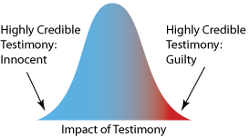
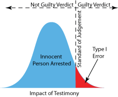
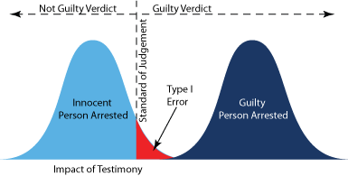
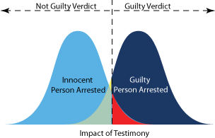
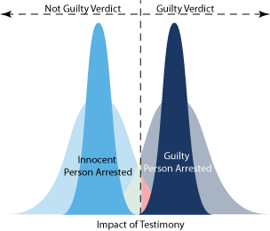
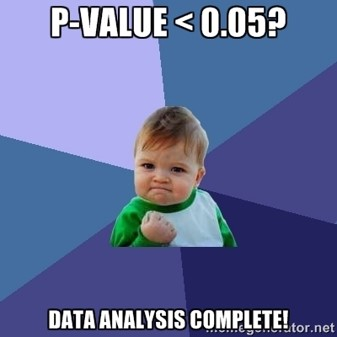

```{r setup, include=FALSE}
options(htmltools.dir.version = FALSE)
knitr::opts_chunk$set(comment     = NA,
                      cache       = TRUE,
                      echo        = TRUE, 
                      warning     = FALSE, 
                      message     = FALSE,
                      fig.align   = "center",   # center all figures
                      fig.width   = 6.5,        # set default figure width to 4 inches
                      fig.height  = 4.5)        # set default figure height to 3 inches
```

class: center, middle


## "I have so heavily emphasized the desirability of working with <br>**few variables and large sample sizes** <br> that some of my students have spread the rumor that my idea of  the **perfect study** is one with 10,000 cases and no variables. <br> **They go too far.** "

### -- Cohen (1990) ["Things I Have Learned (So Far)"](https://tech.me.holycross.edu/files/2015/03/Cohen_1990.pdf) p. 1305

---

## “Next, I have learned and taught that the primary product of research inquiry is one or more measures of **effect size**, not p values.”


### -- Cohen (1994) ["Things I Have Learned (So Far)"](https://tech.me.holycross.edu/files/2015/03/Cohen_1990.pdf) p. 1310

---

## "However, as social scientists move gradually away from reliance on single studies and obsession with null hypothesis testing, **effect size** measures will become more and more popular"

### -- Abelson (1995) ["Statistics as Principled Argument"](https://www.taylorfrancis.com/books/9781410601155) p. 47


---


.pull-left[

```{r, echo=FALSE, fig.align='center'}
knitr::include_graphics('figures/matrix_jury.png')
```

]

--

.pull-right[

```{r, echo=FALSE, fig.align='center'}
knitr::include_graphics('figures/matrix_stats.png')
```

]

---


.pull-leftsmall[.large[
When we conduct a hypothesis test, 
we wither reject or fail to reject the Null Hypothesis.  
Our decision usually causes four outcomes:
]]


.pull-rightbig[

```{r, echo=FALSE, fig.align='center'}
knitr::include_graphics('figures/confusion_matrix.png')
```

]


---

.pull-left[

```{r, echo=FALSE, fig.align='center'}
knitr::include_graphics('figures/preg_type_1.png')
```

* Test Concludes: Reject the Null Hypothesis
* But the Truth is: Null Hypothesis is TRUE

$$
\alpha = P(\text{False Positive})
$$
]

--

.pull-right[

```{r, echo=FALSE, fig.align='center'}
knitr::include_graphics('figures/preg_type_2.png')
```

* Test Concludes: Fail to reject the Null Hypothesis
* But the Truth is: Null Hypothesis is FALSE

$$
\beta = P(\text{False Negative})
$$

]


---


.pull-left[
## Distribution Possible

```{r, echo=FALSE, out.width = "100%", fig.align='center'}

```

Distribution of possible witnesses in a trial **when the accused is innocent**.

Note: [Figures from Tom Rodgers website](http://www.intuitor.com/statistics/T1T2Errors.html)

]

--

.pull-right[
### Standard of Judgement

Distribution of possible witnesses in a trial **when the accused is innocent**, showing the probable outcomes with **a single witness**.

```{r, echo=FALSE, out.width = "75%", fig.align='center'}

```

]


---

What happens not only to innocent suspects but also guilty ones when they are arrested and tried for crimes. In this case, the criminals are c**learly guilty** and face **certain** punishment if arrested.

```{r, echo=FALSE, out.width = "75%", fig.align='center'}

```

If the police bungle the investigation and arrest an innocent suspect, there is still a chance that the innocent person could go to jail. Also, since the normal distribution extends to infinity in both positive and negative directions there is a very slight chance that a guilty person could be found on the left side of the standard of judgment and be incorrectly set free.  

---

Unfortunately, justice is often not as straightforward as illustrated on the last slide. This slide shows the **more typical case** in which the real criminals are **not so clearly guilty**. Notice that the means of the two distributions are much **closer** together. 

```{r, echo=FALSE, out.width = "60%", fig.align='center'}

```

As before, if bungling police officers arrest an innocent suspect there's a **small chance** that the wrong person will be convicted. However, there is now also a **significant chance** that a guilty person will be set free. This is represented by the yellow/green area under the curve on the left and is a type II error.


---

**Increasing sample size** is an obvious way to reduce both types of errors for either the justice system or a hypothesis test. 

```{r, echo=FALSE, out.width = "50%", fig.align='center'}

```


An increase of sample size **narrows** the distribution. Why? Because the distribution represents the **average** of the entire sample instead of just a single data point


---
## POWER = $1 - \beta$

* Reject the Null Hypothesis
* Null Hypothesis is FALSE


---


```{r, echo=FALSE, fig.align='center'}

```


---
class: inverse, center, middle

# Questions?


---
class: inverse, center, middle

# Next Topic

### Independent Samples t Tests for Means