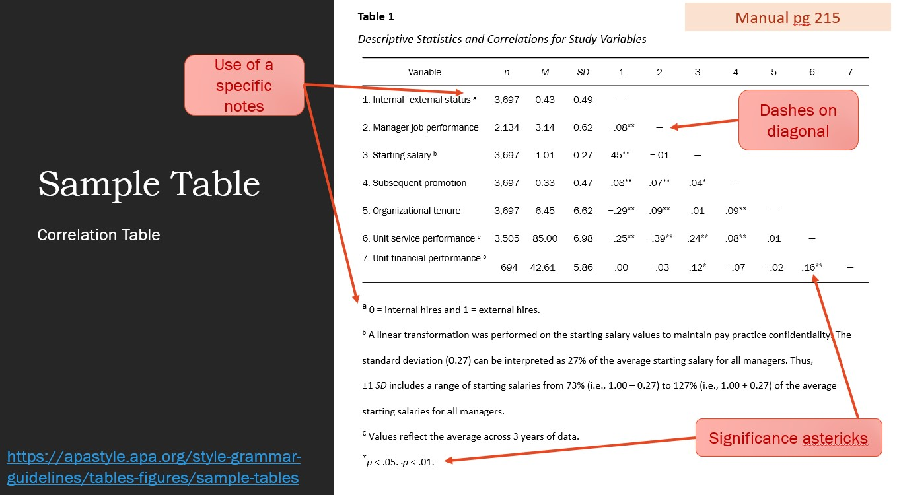

```{r setup, include=FALSE}
options(htmltools.dir.version = FALSE)
knitr::opts_chunk$set(comment     = NA,
                      cache       = FALSE,
                      echo        = TRUE, 
                      warning     = FALSE, 
                      message     = FALSE,
                      fig.align   = "center",   # center all figures
                      fig.width   = 6.5,        # set default figure width to 4 inches
                      fig.height  = 4.5)        # set default figure height to 3 inches
```


```{r, echo=FALSE}
library(tidyverse)
library(ggpubr)
```


class: center, middle

## "Statistics is not a discipline like physics, chemistry, or biology where we study a subject to solve problems in the same subject. <br> We study statistics with the main aim of solving problems in other disciplines."

### -- C.R. Rao, Ph.D. 

---

# Motivating Example

.large[
> Dr. Mortimer is interested in knowing whether people who have a **positive view of themselves in one aspect** of their lives .dcoral[**also tend to**] have a **positive view of themselves in other aspects** of their lives.
]

--

- He has .bluer[**80 men**] complete a **self-concept inventory** that contains .dcoral[**5 scales**]. 

--

- **Four** scales involve questions about how competent respondents feel in the areas of:

   + .nicegreen[**intimate relationships**], 
   + .nicegreen[**relationships with friends**], 
   + .nicegreen[**common sense reasoning and everyday knowledge**], and 
   + .nicegreen[**cademic reasoning and scholarly knowledge**].

--

- The **5th scale** includes items about how competent a person feels .nicegreen[**in general**].

--

.large[
> .dcoral[**10 pairwise correlations**] are computed between all possible pairs of variables.
]

---
# Correlation


.large[
> Interested in .dcoral[**degree** of covariation] or .dcoral[**co-relation**] among .dcoral[**TWO** variables] measured on **SAME** objects/participants
]

--

- Not interested in group differences, per se
- Data can be in raw or standardized format
- Correlation coefficient is .nicegreen[scale-invariant]

--

**Type** of variable makes a difference

- Interval/Ratio Continuous: Correlation (Pearson's product-moment correlation)
- Ordinal: Correlation (Spearman, Tetracloric/Polycloric, Cramer's V, Kendall's Tau, ...)
- Nominal: Association or Dependence 

--

Can test for **significance** of the correlation

- $\Large H_0$: population correlation coefficient = 0


---

## Always **Visualize** Data First

### Scatterplots

```{r, echo=FALSE}
set.seed(843)
df <- tibble::data_frame(
  x = rnorm(100),
  y = x + rnorm(100)
)
```

.pull-left[

*AKA: scatterdiagrams, scattergrams*

Notes:
1. Each subject is represented by 1 dot (x and y coordinate)
2. Fit line can indicate .dcoral[nature] and .dcoral[degree of relationship] (Regression or prediction lines)
3. Can **stratify** scatterplots by .nicegreen[subgroups]


```{r, eval=FALSE}
df %>%
  ggplot(aes(`x`, `y`)) +
    geom_point() +
    geom_smooth(method = "lm")
```
]

.pull-right[
```{r, echo=FALSE}
df %>%
  ggplot(aes(x, y)) +
    geom_point() +
    geom_smooth(method = "lm")
```
]

---
## Correlation: Direction

.pull-left[.center[
### .nicegreen[Positive Association]

**High values** of one variable tend to occur with **High values** of the other
```{r, echo=FALSE}
df %>%
  ggplot(aes(x, y)) +
    geom_point() +
    geom_smooth(se = FALSE,
                method = "lm",
                color = "chartreuse3") 
```
]]

--

.pull-right[.center[
### .bluer[Negative Association]

**High values** of one variable tend to occur with **Low values** of the other
```{r, echo=FALSE}
df %>%
  ggplot(aes(x, -y)) +
    geom_point() +
    geom_smooth(se = FALSE,
                method = "lm",
                color = "dodgerblue3") 
```
]]


---
## Correlation: Strength / Predictability

How much **variation** or **scatter** there is around the main form?


```{r, echo=FALSE}
set.seed(843)
df <- tibble::data_frame(
  x = rnorm(100),
  y = x + rnorm(100)/7,
  y2 = x + rnorm(100)
)
```

.pull-left[.center[
### STRONG
X provided a GOOD estimate of Y
```{r, echo=FALSE}
ggplot(df, aes(x, y)) +
  annotate(geom = "rect",
           xmin = -0.8, xmax = -1.2,
           ymin = -3.0, ymax = +4.0,
           fill = "yellow") +
  annotate(geom = "rect",
           xmin = -0.2, xmax = +0.2,
           ymin = -3.0, ymax = +4.0,
           fill = "blue",
           alpha = .4) +
  annotate(geom = "rect",
           xmin = +0.8, xmax = +1.2,
           ymin = -3.0, ymax = +4.0,
           fill = "green") +
  geom_point() +
  geom_smooth(method = "lm",
              color = "red",
              se = FALSE)
```
]]

--

.pull-right[.center[
### weak
X is associated with a wide range of Y
```{r, echo=FALSE}
ggplot(df, aes(x, y2)) +
  annotate(geom = "rect",
           xmin = -0.8, xmax = -1.2,
           ymin = -3.0, ymax = +4.0,
           fill = "yellow") +
  annotate(geom = "rect",
           xmin = -0.2, xmax = +0.2,
           ymin = -3.0, ymax = +4.0,
           fill = "blue",
           alpha = .4) +
  annotate(geom = "rect",
           xmin = +0.8, xmax = +1.2,
           ymin = -3.0, ymax = +4.0,
           fill = "green") +
  geom_point() +
  geom_smooth(method = "lm",
              color = "red",
              se = FALSE)
```
]]

---

## Scatterplot: Pattern/Form

```{r, echo=FALSE}
set.seed(843)
df <- tibble::data_frame(
  x = rnorm(100),
  y = x + rnorm(100),
  y2 = x^2 + rnorm(100),
  y3 = rnorm(100),
  y4 = 5,
  y5 = x
)
```

.pull-left[
```{r, echo=FALSE, fig.height=3}
ggplot(df, aes(x, y)) +
  geom_point() +
  labs(title = "Linear")
```

```{r, echo=FALSE, fig.height=3}
ggplot(df, aes(x, y2)) +
  geom_point() +
  labs(title = "Non-Linear")
```
]

--

.pull-right[
```{r, echo=FALSE, fig.height=3}
ggplot(df, aes(x, y3)) +
  geom_point() +
  labs(title = "No Relation")
```
```{r, echo=FALSE, fig.height=3}
ggplot(df, aes(x, y4)) +
  geom_point() +
  labs(title = "No Relation")
```
]


---
## Scatterplot: Scale

.pull-left[
```{r, echo=FALSE, fig.height=3}
ggplot(df, aes(x, y)) +
  geom_point() +
  coord_cartesian(ylim = c(-10, 10),
                  xlim = c(-10, 10))
```
```{r, echo=FALSE, fig.height=3}
ggplot(df, aes(x, y)) +
  geom_point()
```
]

.pull-right[
```{r, echo=FALSE, fig.height=3}
ggplot(df, aes(x, y)) +
  geom_point() +
  coord_cartesian(xlim = c(-10, 10))
```
```{r, echo=FALSE, fig.height=3}
ggplot(df, aes(x, y)) +
  geom_point() +
  coord_cartesian(ylim = c(-10, 10))
```
]

--

> Note: all have the same data! Also, `ggplot2`'s defaults are usually pretty good

???
- Using an inappropriate scale for a scatterplot can give an incorrect impression. 
- Both variables should be given a similar amount of space:
  - Plot roughly square
  - Points should occupy all the plot space (no blank space)

---

## Scatterplot: Bivariate Outliers/Leverage


.pull-left[
- An .dcoral[outlier] is a data value that has a very low probability of occurrence (i.e., it is unusual or unexpected). 

- In a scatterplot, BIVARIATE outliers are points that fall outside of the **overall pattern** of the relationship.

- Not all extreme values are outliers

- No data should be "thrown out" unless there is a good reason: error, ect.

]

.pull-right[
```{r, echo=FALSE}
set.seed(843)
df <- tibble::data_frame(
  x = c(rnorm(99), 5),
  y = x + c(rnorm(99), 5)
)
df2 <- tibble::data_frame(
  x = c(rnorm(100)),
  y = x + c(rnorm(99), 10)
)
```
```{r, echo=FALSE, fig.height=6.5, fig.width=8}
p1 = ggplot(df, aes(x, y)) +
  geom_point(size = 2) +
  labs(title = "Extreme Value\n(Possibly not an Outlier)")
p2 = ggplot(df2, aes(x, y)) +
  geom_point(size = 2) +
  labs(title = "Extreme Value\n(Likely an Outlier)")
gridExtra::grid.arrange(p1, p2, ncol = 2)
```

]


---
## Pearson "Product Moment" Correlation Coefficient

> Building block for many other statistical methods


.pull-left[
Used as a measure of: 
- **Magnitude** (strength)   
- **Direction** of relationship  
- Between **2 CONTINUOUS** variables   
- Around **STRAIGHT** regression line   

Applicaitons: Validity & Reliability   
- Test-retest   
- alternative forms   
- split half reliability   
]

--


.pull-left[
**Symbols:** 

Population: $\large \rho$   
Sample: `r` 

**Properties:**

- `x` & `y` are indistinguishable
- has no units
- ranges from `-1` through `+1`
- `r` = 0 is no correlation
- Influenced by outliers
]


---
## Correlation: Calculating Formula

$$ 
\LARGE r = \frac{1}{n - 1} \sum^n_{i = 1} \LARGE(\normalsize\frac{x_i - \bar{x}}{s_x}\LARGE)(\normalsize \frac{y_i - \bar{y}}{s_y}\LARGE)
$$

### Anyone want to do this by hand??

.large[.dcoral[
Let's use R to do this for us 
]]


---
## Correlation: Let R do the work!

```{r, echo=FALSE}
set.seed(345)
df <- tibble::data_frame(
  x_var = rnorm(100),
  y_var = x_var + rnorm(100, 10, 10)
)
```


.pull-left[
.dcoral[Correlation Matrix]
```{r, eval=FALSE}
df %>%
  furniture::tableC(`x_var`, `y_var`)
```
<br>
```{r, echo=FALSE}
df %>%
  furniture::tableC(x_var, y_var)
```
<br>
.nicegreen[
*r* = .178, *p* = .077
]

]

--

.pull-right[
.dcoral[Correlation, CI, and p-value]

```{r, eval=FALSE}
df %>%
  cor.test(~ `x_var` + `y_var`,
           data = .)
```
<br>
```{r, echo=FALSE}
df %>%
  cor.test(~ `x_var` + `y_var`,
           data = .)
```
]


---
.huge[Correlations ONLY describe .dcoral[**LINEAR**] relationships]


```{r, echo=FALSE}
set.seed(678)
df <- tibble::data_frame(
  x = rnorm(100),
  y = x + rnorm(100),
  y2 = x^2 + rnorm(100)
)
```

.pull-left[.center[
### Linear

```{r}

```


```{r, echo=FALSE}
df %>%
  ggplot(aes(x, y)) +
  geom_point() +
  stat_cor(method = "pearson",
           cor.coef.name = "r",
           r.accuracy = 0.001,
           p.accuracy = 0.001,
           cex = 8)
```
]]

.pull-right[.center[
### Non-linear
```{r, echo=FALSE}
df %>%
  ggplot(aes(x, y2)) +
  geom_point()+
  stat_cor(method = "pearson",
           cor.coef.name = "r",
           r.accuracy = 0.001,
           p.accuracy = 0.001,
           cex = 8,
           label.x = -1)
```
]]

.large[
Note: You can sometimes *transform* a non-linear association to a linear form, for instance by taking the logarithm.
]

---
## Let's see it in action

## [Correlation App](http://digitalfirst.bfwpub.com/stats_applet/stats_applet_5_correg.html)

.pull-left[
.large[
- Influential Points

- Eye-ball the correlation

- Draw the line of the best fit
]]

.pull-right[
.large[
Why are correlations not resistant to outliers?

When do outliers have more *leverage*?
]]


---
background-image: url(figures/fig_bivariate_normal.png)
background-position: 80% 50%
background-size: 400px

## Assumptions of Pearson's Correaltion

.pull-left[
.large[
1. Random Sample

2. Relationship is linear (check scatterplot, use transformations)

3. Bivariate normal distribution
    - Each variable should be normally distributed in population
    - Joint distribution should be bivariate normal
    - Curvilinear relationships = violation
    - Less important as N increases
]]


---
## Sampling Distribution of `rho`


.large[
- Normal distribution about 0
- Becomes non-normal as $\Large \rho$ gets larger and deviates from $\Large H_0$ value of 0 in the population
    - Negatively skewed with large, positive null hypothesized $\rho$
    - Positively skewed with large, negative null hypothesized $\rho$
- Leads to 
    - Inaccurate p-values
    - No longer testing $\Large H_0$ that $\Large \rho = 0$
- Fisher's solution: transform sample `r` coefficients to yield normal sampling distribution, regardless of $\LARGE\rho$

*We will let the computer worry about the details...*
]


---
background-image: url(figures/fig_t_table2.png)
background-position: 80% 50%
background-size: 400px


## Hypothesis testing for 1-sample `r`

.pull-left[.dcoral[
.large[
$$ \LARGE H_0: \rho = 0$$
$$\LARGE H_A: \rho \neq 0$$
]]

.center[`r` is converted to a t-statistic]

$$ 
\LARGE t = \frac{r\sqrt{N - 2}}{\sqrt{1 - r^2}}
$$
- Compare to t-distribution with .dcoral[$df = N - 2$]
  - Rejection = statistical evidence of relationship
  - Or look up critical values of `r`
]


---
## Example: Mood & Recall

>Researcher wishes to correlate scores from 2 tests: 
> .nicegreen[current mood state] and .nicegreen[verbal recall memory]


.pull-leftsmall[
```{r, echo=FALSE, comment = "     "}
df <- tibble::tribble(~Mood, ~Recall,
                 45,     48,
                 34,     39,
                 41,     48,
                 25,     27,
                 38,     42,
                 20,     29,
                 45,     30)
df
```

.dcoral[
*r* = .644, *p* = .119   
95% CI [-.212, .941]
]

]

.pull-rightbig[
```{r}
df %>%
  cor.test(~ `Mood` + `Recall`,
           data = .)
```
]

---
## Factors Affecting Validity of `r`


- .dcoral[Range restriction] (variance of X and/or Y)
  - r can be inflated or deflated
  - May be related to small N

- .dcoral[Bivariate Outliers]
  - `r` can be heavily influenced

- Use of .dcoral[heterogeneous sub-samples]
  - Combining data from heterogeneous groups can **inflate** correlation coefficient or yield **spurious results** by stretching out data


---
background-image: url(figures/fig_spurious.jpeg)
background-position: 50% 50%
background-size: 1200px


.footnote[http://www.tylervigen.com/spurious-correlations]


---

<!-- DecisionSkills: How Ice Cream Kills! Correlation vs. Causation (11-1) (5 min)-->

<iframe width="1000" height="750" src="https://www.youtube.com/embed/VMUQSMFGBDo?controls=0&amp;start=2" frameborder="0" allow="accelerometer; autoplay; encrypted-media; gyroscope; picture-in-picture" allowfullscreen></iframe>


---
## Interpretation and Communcation

.large[.dcoral[
**Correlation $\Large \neq$ Causation**, *in an observational study*
]]

But, correlation can be causation...

--

- Can infer **strength** and **direction**; not form or prediction from `r`
- Can say that prediction will be **better** with **large `r`**, but cannot predict actual values

- Statistical significance
  - p-value heavily influenced by **Sample Size**
  - Need to .dcoral[interpret size of r-statistic, more than p-value]


---
## APA: Reporting in Text

.large[
> Example 1.


For .bluer[nine] students, the scores on the first quiz .nicegreen[(*M* = 7.00, *SD* = 1.23)] and the first exam .nicegreen[(*M* = 80.89, *SD* = 6.90)] were strongly and significantly correlated, .dcoral[*r* = .701, *p* = .038].
]

--
<br><br>

.large[
> Example 2.

A Pearson product-moment correlation coefficient was computer to assess the relationship between the amount of water consumption and skin elasticity.  A scatterplot summarizes the results .nicegreen[(see Figure 1)].  Overall, there was a strong, positive correlation between the amount of ware consumed and skin elasticity, .dcoral[*r* = .985, *p* = .002].

]

---

## APA: Correlation Table

```{r,echo=FALSE, out.width = "85%"}

```


---
class: inverse, center, middle

# Let's Apply This to the Cancer Dataset 


---
# Read in the Data

```{r}
library(tidyverse)    # Loads several very helpful 'tidy' packages
library(haven)        # Read in SPSS datasets
library(furniture)    # for tableC()
```

```{r, eval=FALSE}
cancer_raw <- haven::read_spss("cancer.sav")
```

```{r, include=FALSE}
cancer_raw <- haven::read_spss("data/cancer.sav")
```

### And Clean It

```{r, message=FALSE, warning=FALSE}
cancer_clean <- cancer_raw %>% 
  dplyr::rename_all(tolower) %>% 
  dplyr::mutate(id = factor(id)) %>% 
  dplyr::mutate(trt = factor(trt,
                             labels = c("Placebo", 
                                        "Aloe Juice"))) %>% 
  dplyr::mutate(stage = factor(stage))
```

---
## R Code: Defaults

.pull-left[

.dcoral[**DEFAULT**: Pearson's 2-sided, 95% CI]

```{r, eval=FALSE}
cancer_clean %>%
  cor.test(~ `totalcin` + `totalcw2`,
           data = .)
```

> The code ABOVE and BELOW give the same results

```{r, eval=FALSE}
cancer_clean %>%
  cor.test(~ `totalcin` + `totalcw2`,
           data = .,
           alternative = "two.sided",
           method = "pearson",
           conf.level = .95)
```

]

--

.pull-right[
```{r, echo=FALSE}
cancer_clean %>%
  cor.test(~ totalcin + totalcw2,
           data = .)
```
]

--

.dcoral[**Interpretation**]: Oral condition two weeks into the study was not significantly correlated with condition at intake, .nicegreen[*r* = .314, *p* = .126, 95% *CI* [-.092, .631]].


---

## R Code: Directional alternative

.pull-left[

.nicegreen[**NEGATIVE correaltion**]
```{r, eval=FALSE}
cancer_clean %>%
  cor.test(~ totalcin + totalcw2,
           data = .,
           `alternative = "less"`)
```


.nicegreen[**POSITIVE correlation**]
```{r, eval=FALSE}
cancer_clean %>%
  cor.test(~ totalcin + totalcw2,
           data = .,
           `alternative = "greater"`)
```

> .dcoral[NOTE]: **NEVER** use the confidence intervals from a 1-tailed test!  You MUST run a 2-tailed test to get a real confidence interval.

]

.pull-right[
```{r, echo=FALSE}
cancer_clean %>%
  cor.test(~ totalcin + totalcw2,
           data = .,
           alternative = "less")
```

```{r, echo=FALSE}
cancer_clean %>%
  cor.test(~ totalcin + totalcw2,
           data = .,
           alternative = "greater")
```
]

---

## R Code: Correlation Tables, with missing values

.pull-left[
```{r, eval=FALSE}
cancer_clean %>%
  `furniture::tableC`(totalcin, totalcw2, 
                    totalcw4, totalcw6)
```

```{r, echo=FALSE}
cancer_clean %>%
  furniture::tableC(totalcin, totalcw2, 
                    totalcw4, totalcw6)
```
]

--

.pull-right[
.dcoral[*List-wise Deletion*]: only complete cases
```{r, eval=FALSE}
cancer_clean %>%
  `furniture::tableC`(totalcin, totalcw2, 
                    totalcw4, totalcw6,
                    `na.rm = TRUE`)
```
]


```{r, echo=FALSE}
cancer_clean %>%
  furniture::tableC(totalcin, totalcw2, 
                    totalcw4, totalcw6,
                    na.rm = TRUE)
```


---
## R Code: Scatterplot with Regression Line

.pull-left[
```{r, eval=FALSE}
cancer_clean %>%
  ggplot(aes(x = totalcin, 
             y = totalcw2)) +
  `geom_point()` +
  geom_smooth(method = "lm")
```

```{r, echo=FALSE}
cancer_clean %>%
  ggplot(aes(x = totalcin, 
             y = totalcw2)) +
  geom_point() +
  geom_smooth(method = "lm")
```
]


--

.pull-right[
```{r, eval=FALSE}
cancer_clean %>%
  ggplot(aes(x = totalcin, 
             y = totalcw2)) +
  `geom_count()` +
  geom_smooth(method = "lm")
```

```{r, echo=FALSE}
cancer_clean %>%
  ggplot(aes(x = totalcin, 
             y = totalcw2)) +
  geom_count() +
  geom_smooth(method = "lm")
```
]


---
class: inverse, center, middle

# Questions?


---
class: inverse, center, middle

# Next Topic

### Linear Regression